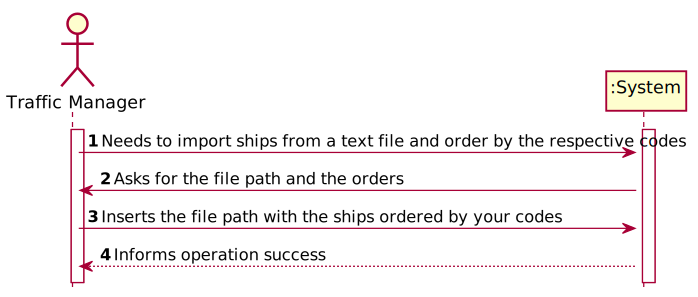

# US 101 - To import ships from a text file into a BST

## 1. Requirements Engineering

### 1.1. User Story Description

As a traffic manager, I which to import ships from a text file into a BST.

### 1.2. Acceptance Criteria

n.a.

### 1.4. Found out Dependencies

No dependencies

### 1.5 Input and Output Data

**Input Data:**

* Typed data:
    *   fileName
    *   
    *   

* Selected data:
    *   fileName

**Output Data:**

* (In)Success of the operation

### 1.6. System Sequence Diagram (SSD)

### 1.7 Other Relevant Remarks

## 2. OO Analysis

### 2.1. Relevant Domain Model Excerpt

### 2.2. Other Remarks

* n/a

### Systematization ##

According to the taken rationale, the conceptual classes promoted to software classes are:

* Ship
* AVL

Other software classes (i.e. Pure Fabrication) identified:

* LoadShipUI
* LoaderController

## 3.2. Sequence Diagram (SD)

## 3.3. Class Diagram (CD)

# 4. Tests

**Test 1:** Check that it is not possible to import  a Ship without all attributes assigned to it. (AC1/2)

          @Test
          void getImo() {
             Ship shipTest = new Ship(210950000,"VARAMO","IMO9395044","C4SQ2",70,166,25,9.5f,"NA");
             String imo = "IMO9395044";
             String result = shipTest.getImo();
             assertEquals(imo,result);
          }

          @Test
          void getCallSign() {
             Ship shipTest = new Ship(210950000,"VARAMO","IMO9395044","C4SQ2",70,166,25,9.5f,"NA");
             String callSign = "C4SQ2";
             String result = shipTest.getCallSign();
             assertEquals(callSign,result);
          }

# 5. Construction (Implementation)

## Class LoaderController

    public static AVL<Ship> loadShipsByMmsi(String fileName) throws FileNotFoundException {
        AVL <Ship> avlMmsi = new AVL<>();
        File file = new File(fileName);

        Scanner in = new Scanner(file);
        String line = in.nextLine();

        while (in.hasNextLine()) {
            String read[] = in.nextLine().trim().split(",");
            Ship ship = new Ship(Integer.parseInt(read[0]),read[7],read[8],read[9],Integer.parseInt(read[10]),
            Integer.parseInt(read[11]),Integer.parseInt(read[12]),Float.parseFloat(read[13]),read[14]);
            avlMmsi.insert(ship);
        }
        return avlMmsi;
    }

    public AVL<Ship> loadShipsByCallSign(String fileName) throws FileNotFoundException {
        AVL <Ship> avlCallSign = new AVL<>();
        File file = new File(fileName);

        Scanner in = new Scanner(file);
        String line = in.nextLine();

        while (in.hasNextLine()) {
            String read[] = in.nextLine().trim().split(",");
            ShipOrderedByCallSign ship = new ShipOrderedByCallSign(Integer.parseInt(read[0]),read[7],read[8],read[9],Integer.parseInt(read[10]),
                    Integer.parseInt(read[11]),Integer.parseInt(read[12]),Float.parseFloat(read[13]),read[14]);
            avlCallSign.insert(ship);
        }
        return avlCallSign;
    }

    public AVL<Ship> loadShipsByIMO(String fileName) throws FileNotFoundException {
        AVL <Ship> avlIMO = new AVL<>();
        File file = new File(fileName);

        Scanner in = new Scanner(file);
        String line = in.nextLine();

        while (in.hasNextLine()) {
            String read[] = in.nextLine().trim().split(",");
            ShipOrderedByIMO shipIMO = new ShipOrderedByIMO(Integer.parseInt(read[0]),read[7],read[8],read[9],Integer.parseInt(read[10]),
                    Integer.parseInt(read[11]),Integer.parseInt(read[12]),Float.parseFloat(read[13]),read[14]);
            avlIMO.insert(shipIMO);
        }
        return avlIMO;
    }

## Class Ship
       public Ship(int mmsi, String vesselName, String imo, String callSign, int vesselType, int length, int width,
                   float draft, String cargo) {
                 this.mmsi = mmsi;
                 this.vesselName = vesselName;
                 this.imo = imo;
                 this.callSign = callSign;
                 this.vesselType = vesselType;
                 this.length = length;
                 this.width = width;
                 this.draft = draft;
                 this.cargo = cargo;
                 this.numEnergyGen = 0.0;
                 this.powerOutput = POWER_OUTPUT;
       }

# 6. Integration and Demo

* n/a

# 7. Observations

* n/a

