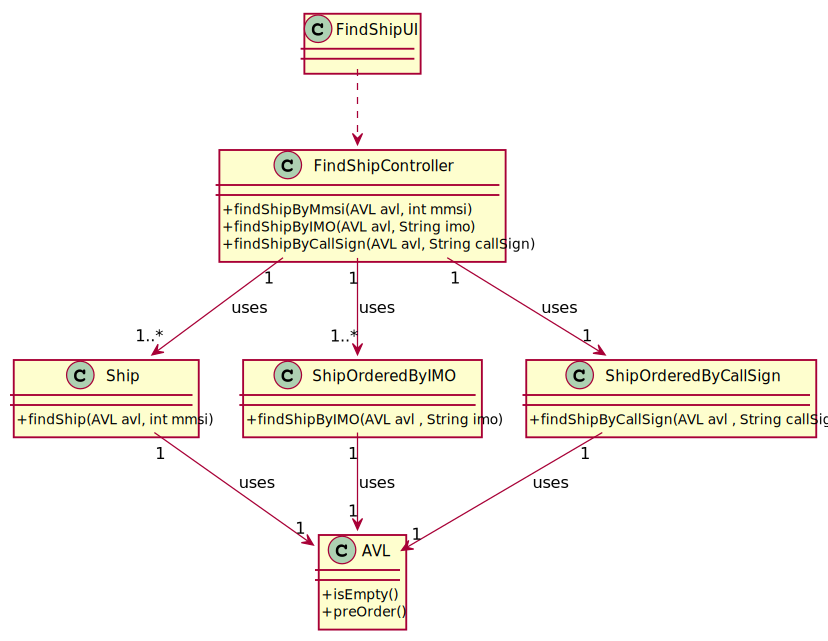

# US 102 - To search the details of a ship using any of its codes: MMSI, IMO or Call Sign.

## 1. Requirements Engineering

### 1.1. User Story Description

As a traffic manager I which to search the details of a ship using any of its codes:
MMSI, IMO or Call Sign.

### 1.2. Acceptance Criteria

- correct use of OOP concepts.

### 1.3. Found out Dependencies

- US101

### 1.5 Input and Output Data

**Input Data:**

* Typed data:
    * code
    
    

* Selected data:
    *code

**Output Data:**

* (In)Success of the operation

### 1.6. System Sequence Diagram (SSD)

### 1.7 Other Relevant Remarks

## 2. OO Analysis

### 2.1. Relevant Domain Model Excerpt

### 2.2. Other Remarks

* n/a

## 3. Design - User Story Realization

### Systematization ##

According to the taken rationale, the conceptual classes promoted to software classes are:

* Ship
* AVL
* ShipOrderedByIMO
* ShipOrderedByCallSign

Other software classes (i.e. Pure Fabrication) identified:

* FindShipUI
* FindShipController

## 3.2. Sequence Diagram (SD)

## 3.3. Class Diagram (CD)

# 4. Tests

**Test 1:** Check if its possible find a ship

          @Test
          void findShip() throws FileNotFoundException {
          Ship shipTest = new Ship(210950000,"VARAMO","IMO9395044","C4SQ2",70,166,25,9.5f,"NA");
          AVL<Ship> bstMmsi = new AVL<>();
          File file = new File("sships.csv");

          Scanner in = new Scanner(file);
          String line = in.nextLine();

          while (in.hasNextLine()) {
            String read[] = in.nextLine().trim().split(",");
            Ship ship = new Ship(Integer.parseInt(read[0]),read[7],read[8],read[9],Integer.parseInt(read[10]),
                    Integer.parseInt(read[11]),Integer.parseInt(read[12]),Float.parseFloat(read[13]),read[14]);
            bstMmsi.insert(ship);
          }
          Ship shipResult = Ship.findShip(bstMmsi,210950000);
          assertEquals(shipTest.getMmsi(),shipResult.getMmsi());
    }

# 5. Construction (Implementation)

## Class FindShipController

    public Ship findShipByMmsi(AVL avl, int mmsi) {
        Ship ship = null;
        ship = Ship.findShip(avl, mmsi);
        return ship;
    }

    public Ship findShipByIMO(AVL avl, String imo) {
        Ship ship = null;
        ship = ShipOrderedByIMO.findShipByIMO(avl, imo);
        return ship;
    }

    public Ship findShipByCallSign(AVL avl, String callSign) {
        Ship ship = null;
        ship = ShipOrderedByCallSign.findShipByCallSign(avl, callSign);
        return ship;
    }

# 6. Integration and Demo

* n/a

# 7. Observations

* n/a

