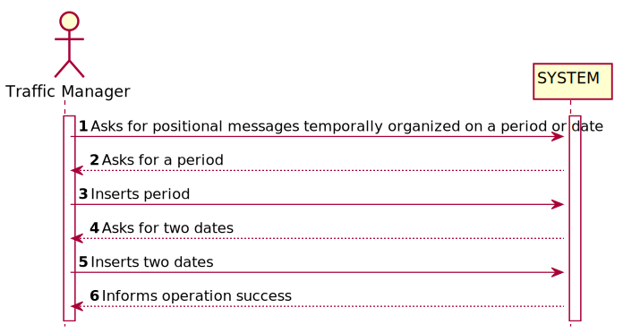
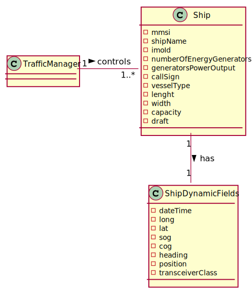
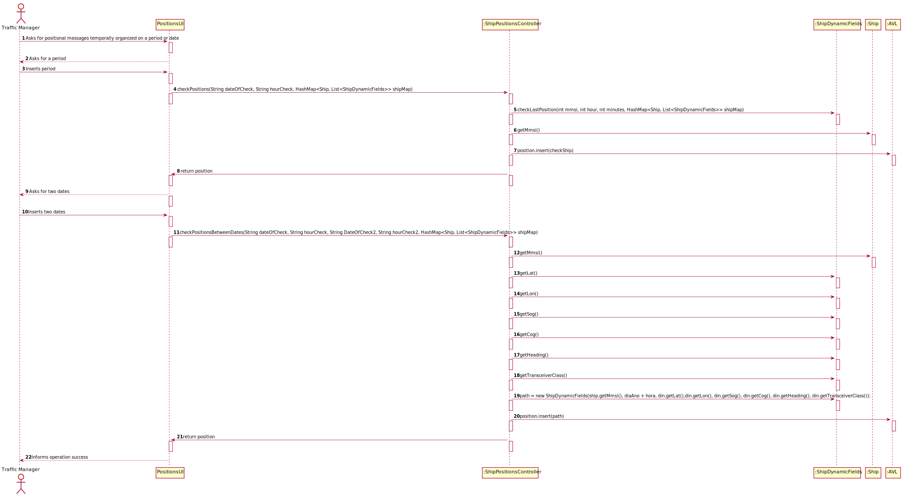
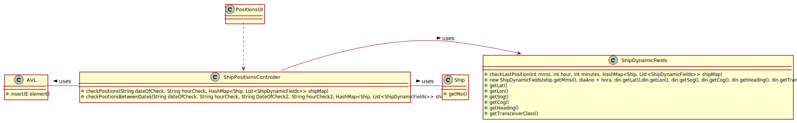

# US 103 - To have the positional messages temporally organized and associated with each of the ships

## 1. Requirements Engineering

### 1.1. User Story Description

As a traffic manager I which to have the positional messages temporally
organized and associated with each of the ships

### 1.2. Acceptance Criteria

- efficient access of any position value(s) of a ship on a period or date.
### 1.3. Found out Dependencies

- US101

### 1.4 Input and Output Data

**Input Data:**

* Typed data:
    * period
    * date1
    * date2

* Selected data:
    *

**Output Data:**

* (In)Success of the operation

### 1.5. System Sequence Diagram (SSD)

### 1.6 Other Relevant Remarks

## 2. OO Analysis

### 2.1. Relevant Domain Model Excerpt

### 2.2. Other Remarks

* n/a

## 3. Design - User Story Realization

### Systematization ##

According to the taken rationale, the conceptual classes promoted to software classes are:

* Ship
* ShipDynamicFields
* AVL

Other software classes (i.e. Pure Fabrication) identified:

* PositionsUI
* ShipPositionsController

## 3.2. Sequence Diagram (SD)

## 3.3. Class Diagram (CD)

# 4. Tests

**Test 1:** **ShipPositionsControllerTest**
            

             @Test
    void checkPositions() throws FileNotFoundException {
        String date = "31/12/2020";
        String hour =  "17:15";
        ShipDynamicFields test1=new ShipDynamicFields(210950000,"31/12/2020 17:15",42.96527,-66.97082,12.8,-58.6,358,"B");
        ShipDynamicFields test2=new ShipDynamicFields(228339600,"31/12/2020 03:56",27.87869,-88.22321,11.7,127.9,128,"B");

        AVL<ShipDynamicFields> result = ShipPositionsController.checkPositions(date,hour, shipMap);
        AVL<ShipDynamicFields> expected = new AVL<>();
        expected.insert(test1);
        expected.insert(test2);
        assertEquals(result,expected) ;
    }

    @Test
    void checkPositionsBetweenDates() throws FileNotFoundException {
        String date = "31/12/2020";
        String hour =  "17:10";
        String date2 = "31/12/2020";
        String hour2 =  "17:15";
        ShipDynamicFields test1=new ShipDynamicFields(210950000,"31/12/2020 17:15",42.96527,-66.97082,12.8,-58.6,358,"B");

        AVL<ShipDynamicFields> result = ShipPositionsController.checkPositionsBetweenDates(date,hour,date2,hour2,shipMap);
        AVL<ShipDynamicFields> expected = new AVL<>();
        expected.insert(test1);
        assertEquals(result,expected);
    }

    

# 5. Construction (Implementation)

## Class ShipPositionsController

    public static AVL<ShipDynamicFields> checkPositions(String dateOfCheck, String hourCheck,
                                                        HashMap<Ship, List<ShipDynamicFields>> shipMap) throws FileNotFoundException {
        AVL<ShipDynamicFields> position = new AVL<>();

        for(Ship ship : shipMap.keySet()) {
           String read[] = hourCheck.split(":");
            ShipDynamicFields checkShip = ShipDynamicFields.checkLastPosition(ship.getMmsi(),
                    Integer.parseInt(read[0]), Integer.parseInt(read[1]), shipMap);
            position.insert(checkShip);
            }
        return position;
    }

    public static AVL<ShipDynamicFields> checkPositionsBetweenDates(String dateOfCheck, String hourCheck, String DateOfCheck2, String hourCheck2, HashMap<Ship, List<ShipDynamicFields>> shipMap) throws FileNotFoundException {
        AVL<ShipDynamicFields> position = new AVL<>();

        for(Ship ship : shipMap.keySet()) {
            for (List<ShipDynamicFields> ships : shipMap.values()) {
                for (ShipDynamicFields din : ships) {
                        String read[] = din.getDateTime().split(" ");
                        String diaAno = read[0];
                        String hora = read[1];
                        String read3[] = hora.split(":");
                        int hour3 = Integer.parseInt(read3[0]);
                        int minutes3 = Integer.parseInt(read3[1]);
                        String read2[] = hourCheck.split(":");
                        int hour = Integer.parseInt(read2[0]);
                        int minutes = Integer.parseInt(read2[1]);
                        String read1[] = hourCheck2.split(":");
                        int hour1 = Integer.parseInt(read1[0]);
                        int minutes1 = Integer.parseInt(read1[1]);
                        if (dateOfCheck.equals(diaAno) && hour3 >= hour && hour3 <= hour1 && minutes3 >= minutes && minutes3 <= minutes1) {
                            ShipDynamicFields path = new ShipDynamicFields(ship.getMmsi(), diaAno + hora, din.getLat(),din.getLon(), din.getSog(), din.getCog(),
                                    din.getHeading(), din.getTransceiverClass());
                            position.insert(path);
                        }
                    }
                }
            }
        return position;
    }

# 6. Integration and Demo

* n/a

# 7. Observations

* n/a

