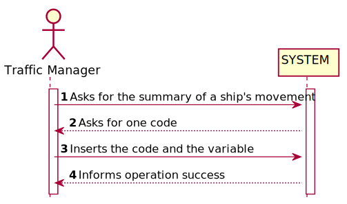
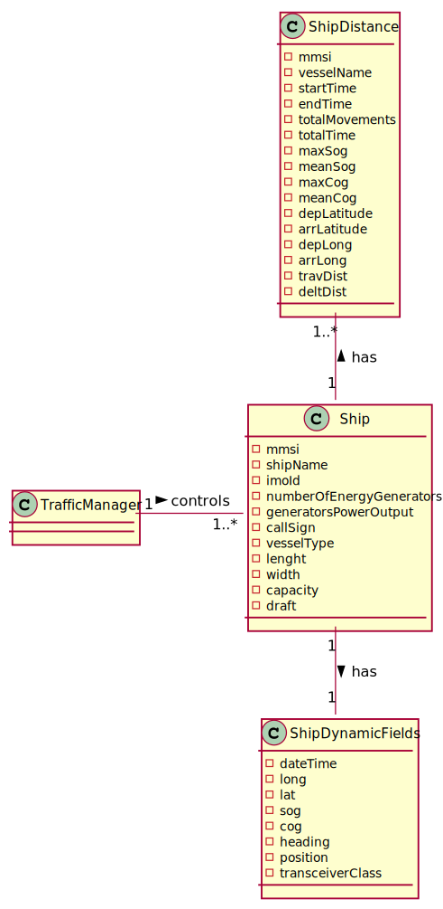
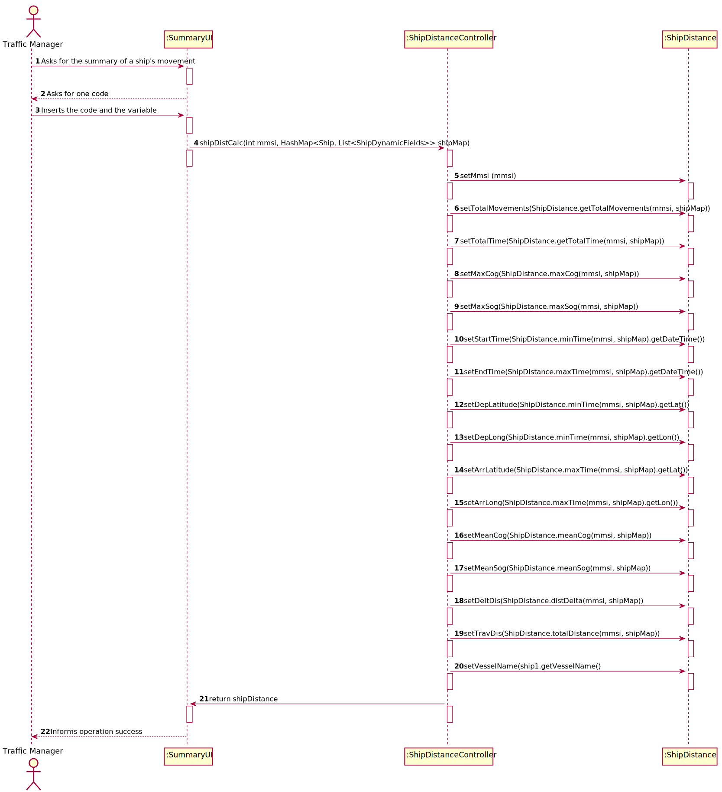
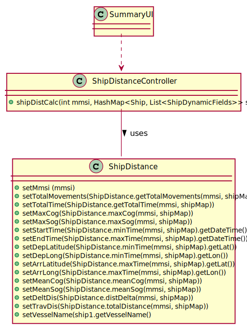

# US 104 - To make a Summary of a ship's movements.

## 1. Requirements Engineering

### 1.1. User Story Description

As a traffic manager I which to make a Summary of a ship's movements.

### 1.2. Acceptance Criteria
- For a given ship return in an appropriate structure one of its codes
  (MMSI, IMO or Call Sign), Vessel Name, Start Base Date Time, End
  Base Date Time, Total Movement Time, Total Number of Movements,
  Max SOG, Mean SOG, Max COG, Mean COG, Departure Latitude,
  Departure Longitude, Arrival Latitude, Arrival Longitude, Travelled
  Distance (incremental sum of the distance between each positioning
  message) and Delta Distance (linear distance between the coordinates of
  the first and last move)
  

### 1.3. Found out Dependencies
- US103
- US101

### 1.4 Input and Output Data

**Input Data:**

* Typed data:
    * code
    * variable
    

* Selected data:
    *

**Output Data:**

* (In)Success of the operation

### 1.5. System Sequence Diagram (SSD)

### 1.6 Other Relevant Remarks

## 2. OO Analysis

### 2.1. Relevant Domain Model Excerpt

### 2.2. Other Remarks

* n/a

## 3. Design - User Story Realization

### Systematization ##

According to the taken rationale, the conceptual classes promoted to software classes are:

* ShipDistance

Other software classes (i.e. Pure Fabrication) identified:

* SummaryUI
* ShipDistanceController

## 3.2. Sequence Diagram (SD)

## 3.3. Class Diagram (CD)

# 4. Tests

**Test 1:** **ShipDistanceControllerTest**

            @Test
    void shipDistCalc() throws FileNotFoundException {
        int mmsi =210950000;
        ShipDistance result = ShipDistanceController.shipDistCalc(mmsi, shipMap);
        System.out.println(result);
        ShipDistance ship = new ShipDistance(210950000,"VARAMO","31/12/2020 16:00","31/12/2020 17:15", 4, "1:15", 13.7, 13.25,3.4,-26.85,42.69577,42.96527,-66.97808,-66.97082,ShipDistance.totalDistance(210950000,shipMap),ShipDistance.distDelta(210950000,shipMap));
      //  ShipDistance ship = new ShipDistance(210950000,"VARAMO","31/12/2020 17:15","31/12/2020 17:15", 1, "0:0", 12.8, 12.8,-58.6,-58.6,42.96527,42.96527,-66.97082,-66.97082,0.0,0.0);
        assertEquals(ship,result);
    }

**ShipDistanceTest**

         @Test
    void getTotalTime() throws FileNotFoundException {
        ShipDistance ship = new ShipDistance(210950000, "VARAMO", "31/12/2020 16:30", "31/12/2020 17:15", 4, "0:45", 13.7, 13.25, 3.4, -26.85, 42.69577, 42.96527, -66.97808, -66.97082, ShipDistance.totalDistance(210950000, shipMap), ShipDistance.distDelta(210950000, shipMap));
        String result = ship.getTotalTime();
        String expected = "0:45";
        assertEquals(result,expected);
    }

    @Test
    void getTotalTime2() throws FileNotFoundException {
        ShipDistance ship = new ShipDistance(210950000, "VARAMO", "31/12/2020 16:00", "31/12/2020 17:15", 4, "1:15", 13.7, 13.25, 3.4, -26.85, 42.69577, 42.96527, -66.97808, -66.97082, ShipDistance.totalDistance(210950000, shipMap), ShipDistance.distDelta(210950000, shipMap));
        String result = ship.getTotalTime();
        String expected = "1:15";
        assertEquals(result,expected);
    }

    @Test
    void getTotalTime3() throws FileNotFoundException {
        ShipDistance ship = new ShipDistance(210950000, "VARAMO", "31/12/2020 17:00", "31/12/2020 17:15", 4, "0:15", 13.7, 13.25, 3.4, -26.85, 42.69577, 42.96527, -66.97808, -66.97082, ShipDistance.totalDistance(210950000, shipMap), ShipDistance.distDelta(210950000, shipMap));
        String result = ship.getTotalTime();
        String expected = "0:15";
        assertEquals(result,expected);
    }

             

# 5. Construction (Implementation)

## Class ShipDistanceController

        public static ShipDistance shipDistCalc(int mmsi, HashMap<Ship, List<ShipDynamicFields>> shipMap) throws FileNotFoundException {
        ShipDistance shipDistance = new ShipDistance();
        shipDistance.setMmsi(mmsi);
        shipDistance.setTotalMovements(ShipDistance.getTotalMovements(mmsi, shipMap));
        shipDistance.setTotalTime(ShipDistance.getTotalTime(mmsi, shipMap));
        shipDistance.setMaxCog(ShipDistance.maxCog(mmsi, shipMap));
        shipDistance.setMaxSog(ShipDistance.maxSog(mmsi, shipMap));
        shipDistance.setStartTime(ShipDistance.minTime(mmsi, shipMap).getDateTime());
        shipDistance.setEndTime(ShipDistance.maxTime(mmsi, shipMap).getDateTime());
        shipDistance.setDepLatitude(ShipDistance.minTime(mmsi, shipMap).getLat());
        shipDistance.setDepLong(ShipDistance.minTime(mmsi, shipMap).getLon());
        shipDistance.setArrLatitude(ShipDistance.maxTime(mmsi, shipMap).getLat());
        shipDistance.setArrLong(ShipDistance.maxTime(mmsi, shipMap).getLon());
        shipDistance.setMeanCog(ShipDistance.meanCog(mmsi, shipMap));
        shipDistance.setMeanSog(ShipDistance.meanSog(mmsi, shipMap));
        shipDistance.setDeltDis(ShipDistance.distDelta(mmsi, shipMap));
        shipDistance.setTravDis(ShipDistance.totalDistance(mmsi, shipMap));
        for (Ship ship1 : shipMap.keySet()) {
            if (ship1.getMmsi() == mmsi) {
                shipDistance.setVesselName(ship1.getVesselName());
            }
        }
        return shipDistance;
    }

##Class ShipDistance

         public static int getTotalMovements(int mmsi,HashMap<Ship, List<ShipDynamicFields>> shipMap) {
        int counter = 0;
        for (List<ShipDynamicFields>ship : shipMap.values()) {
            for (ShipDynamicFields shipDynamicFields : ship) {
                if (shipDynamicFields.getMMSI() == mmsi) {
                    counter++;
                }
            }
        }
        return counter;
    }

    public static String getTotalTime(int mmsi,HashMap<Ship, List<ShipDynamicFields>> shipMap) {
        int minHora = 25;
        int minMin = 61;
        int maxHora = -1;
        int maxMin = -1;
        int difHora = 0;
        int difMin = 0;

        for (List<ShipDynamicFields>ship : shipMap.values()) {
            for (ShipDynamicFields shipDynamicFields : ship) {
                if (shipDynamicFields.getMMSI() == mmsi) {
                    String read = shipDynamicFields.getDateTime().split("/s")[0];
                    String hora = read.split(" ")[1];
                    String[] read2 = hora.split(":");
                    int hour = Integer.parseInt(read2[0]);
                    int minutes = Integer.parseInt(read2[1]);
                    if (hour < minHora) {
                        minHora = hour;
                        minMin = minutes;
                    }
                    if (hour == minHora && minutes < minMin) {
                        minHora = hour;
                        minMin = minutes;
                    }
                    if (hour > maxHora) {
                        maxHora = hour;
                        maxMin = minutes;
                    }
                    if (hour == maxHora && minutes > maxMin) {
                        maxHora = hour;
                        maxMin = minutes;
                    }
                    difHora = maxHora - minHora;
                    difMin = maxMin - minMin;
                    if (difMin < 0) {
                        difHora = difHora - 1;
                        difMin = 60 + difMin;
                    }
                }
            }
        }
        return String.valueOf(difHora) + ':' + difMin;
    }

    public static double maxCog(int mmsi,HashMap<Ship, List<ShipDynamicFields>> shipMap) {
        double min = -999999;
        for (List<ShipDynamicFields>ship : shipMap.values()) {
            for (ShipDynamicFields shipDynamicFields : ship) {
                if (shipDynamicFields.getMMSI() == mmsi) {
                    if (shipDynamicFields.getCog() > min) {
                        min = shipDynamicFields.getCog();
                    }
                }
            }
        }
        return min;
    }

    public static double maxSog(int mmsi,HashMap<Ship, List<ShipDynamicFields>> shipMap) {
        double min = 0;
            for (List<ShipDynamicFields>ship : shipMap.values()) {
                for (ShipDynamicFields shipDynamicFields : ship) {
            if (shipDynamicFields.getMMSI() == mmsi) {
                if (shipDynamicFields.getSog() > min) {
                    min = shipDynamicFields.getSog();
                }
            }
        }
            }
        return min;
    }

    public static double meanCog(int mmsi,HashMap<Ship, List<ShipDynamicFields>> shipMap) {
        double counter = 0;
        double total = 0;
        for (List<ShipDynamicFields>ship : shipMap.values()) {
            for (ShipDynamicFields shipDynamicFields : ship) {
                if (shipDynamicFields.getMMSI() == mmsi) {
                    total = total + shipDynamicFields.getCog();
                    counter++;

                }
            }
        }
        if(counter!=0) {
            return total / counter;
        }else
            return 0;
    }

    public static double meanSog(int mmsi,HashMap<Ship, List<ShipDynamicFields>> shipMap) {
        double counter = 0;
        double total = 0;
        for (List<ShipDynamicFields>ship : shipMap.values()) {
            for (ShipDynamicFields shipDynamicFields : ship) {
                if (shipDynamicFields.getMMSI() == mmsi) {
                    total = total + shipDynamicFields.getSog();
                    counter++;

                }
            }
        }
        if(counter!=0) {
            return total / counter;
        }else
            return 0;
    }

    public static ShipDynamicFields minTime(int mmsi,HashMap<Ship, List<ShipDynamicFields>> shipMap) {
        int minHora = 25;
        int minMin = 61;

        ShipDynamicFields finalShip = null;
        for (List<ShipDynamicFields> ship : shipMap.values()) {
            for (ShipDynamicFields shipDynamicFields : ship) {
                if (shipDynamicFields.getMMSI() == mmsi) {
                    String read = shipDynamicFields.getDateTime().split("/s")[0];
                    String hora = read.split(" ")[1];
                    String[] read2 = hora.split(":");
                    int hour = Integer.parseInt(read2[0]);
                    int minutes = Integer.parseInt(read2[1]);
                    if (hour < minHora) {
                        minHora = hour;
                        minMin = minutes;
                        finalShip = shipDynamicFields;
                    }
                    if (hour == minHora && minutes < minMin) {
                        minHora = hour;
                        minMin = minutes;
                        finalShip = shipDynamicFields;
                    }
                }
            }
        }

        return finalShip;
    }

    public static ShipDynamicFields maxTime(int mmsi,HashMap<Ship, List<ShipDynamicFields>> shipMap) {
        int maxHora = -1;
        int maxMin = -1;
        ShipDynamicFields finalShip = null;
        for (List<ShipDynamicFields>ship : shipMap.values()) {
            for (ShipDynamicFields shipDynamicFields : ship) {
                if (shipDynamicFields.getMMSI() == mmsi) {
                    String read = shipDynamicFields.getDateTime().split("/s")[0];
                    String hora = read.split(" ")[1];
                    String[] read2 = hora.split(":");
                    int hour = Integer.parseInt(read2[0]);
                    int minutes = Integer.parseInt(read2[1]);
                    if (hour > maxHora) {
                        maxHora = hour;
                        maxMin = minutes;
                        finalShip = shipDynamicFields;
                    }
                    if (hour == maxHora && minutes > maxMin) {
                        maxHora = hour;
                        maxMin = minutes;
                        finalShip = shipDynamicFields;
                    }
                }
            }
        }
        return finalShip;
    }

    public static double distDelta(int mmsi,HashMap<Ship, List<ShipDynamicFields>> shipMap) {
        ShipDynamicFields ship1 = ShipDistance.minTime(mmsi,shipMap);
        ShipDynamicFields ship2 = ShipDistance.maxTime(mmsi,shipMap);

        return distance(ship1.getLat(), ship2.getLat(), ship1.getLon(), ship2.getLon());

    }

    public static double distance(
            double lat1, double lat2, double lon1, double lon2
    ) {

        final int R = 6371; // Radius of the earth

        double latDistance = Math.toRadians(lat2 - lat1);
        double lonDistance = Math.toRadians(lon2 - lon1);
        double a = Math.sin(latDistance / 2) * Math.sin(latDistance / 2)
                + Math.cos(Math.toRadians(lat1)) * Math.cos(Math.toRadians(lat2))
                * Math.sin(lonDistance / 2) * Math.sin(lonDistance / 2);
        double c = 2 * Math.atan2(Math.sqrt(a), Math.sqrt(1 - a));
        double distance = R * c * 1000; // convert to meters

        distance = Math.pow(distance, 2);

        return Math.sqrt(distance);
    }

    public static double totalDistance(int mmsi,HashMap<Ship, List<ShipDynamicFields>> shipMap) {
        double counter = 0;
        double lastLat = 0;
        double lastLon = 0;
        for (List<ShipDynamicFields>ship : shipMap.values()) {
            for (ShipDynamicFields shipDynamicFields : ship) {
                if (shipDynamicFields.getMMSI() == mmsi) {
                    if (lastLat == 0 && lastLon == 0) {
                        lastLat = shipDynamicFields.getLat();
                        lastLon = shipDynamicFields.getLon();
                    }
                    counter = counter + distance(shipDynamicFields.getLat(), lastLat, shipDynamicFields.getLon(), lastLon);
                    lastLat = shipDynamicFields.getLat();
                    lastLon = shipDynamicFields.getLon();
                }
            }
        }
        return counter;
    }

# 6. Integration and Demo

* n/a

# 7. Observations

* n/a

