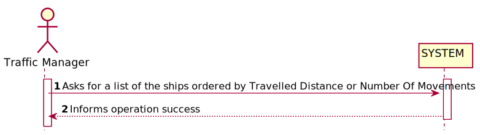
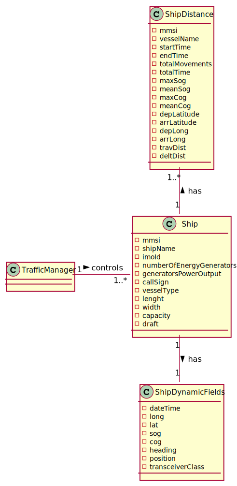
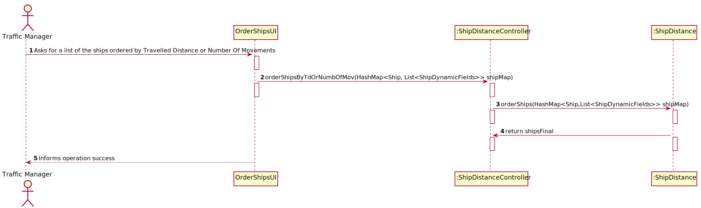
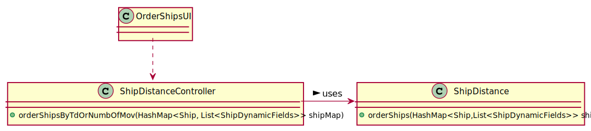

# US105 - To list for all ships the MMSI, the total number of movements, Travelled Distance and Delta Distance

## 1. Requirements Engineering

### 1.1. User Story Description

As a traffic manager I which to list for all ships the MMSI, the total number of
movements, Travelled Distance and Delta Distance

### 1.2. Acceptance Criteria

- ordered by Travelled Distance and total number of movements(descending/ascending).

### 1.3. Found out Dependencies
- US101
- US104

### 1.4 Input and Output Data

**Input Data:**

* Typed data:
    * n.a.
    

* Selected data:
    *

**Output Data:**

* (In)Success of the operation

### 1.5. System Sequence Diagram (SSD)

### 1.6 Other Relevant Remarks

## 2. OO Analysis

### 2.1. Relevant Domain Model Excerpt

### 2.2. Other Remarks

* n/a

## 3. Design - User Story Realization

### Systematization ##

According to the taken rationale, the conceptual classes promoted to software classes are:

* ShipDistance

Other software classes (i.e. Pure Fabrication) identified:

* OrderShipsUI
* ShipDistanceController

## 3.2. Sequence Diagram (SD)

## 3.3. Class Diagram (CD)

# 4. Tests

**Test 1:** **ShipDistanceControllerTest**

        @Test
        void orderShipsByTdOrNumbOfMov() throws FileNotFoundException {
        List<ShipDistance> result = ShipDistanceController.orderShipsByTdOrNumbOfMov(shipMap);
        System.out.println(result);
        ShipDistance shipDistance = new ShipDistance(228339600, "CMA CGM ALMAVIVA", "31/12/2020 00:00", "31/12/2020 03:56", 4, "3:56", 11.8, 11.649999999999999, 131.1, 128.525, 28.37458, 27.87869, -88.88584, -88.22321, 162428.5318463634, 85222.07283417834);
        ShipDistance shipDistance1= new ShipDistance(210950000, vesselName='VARAMO', startTime='31/12/2020 16:00', endTime='31/12/2020 17:15', totalMovements=4, totalTime='1:15', maxSog=13.7, meanSog=13.25, maxCog=3.4, meanCog=-26.85, depLatitude=42.69577, arrLatitude=42.96527, depLong=-66.97808, arrLong=-66.97082, travDis=74447.79840206594, deltDis=29972.880199805448}]
        assertEquals(shipDistance, result);

    }

**ShipDistanceTest**

    @Test
    void orderShips() throws FileNotFoundException {
    List<ShipDistance> result = ShipDistance.orderShips(shipMap);
    List<ShipDistance> expected = new ArrayList<>();
    ShipDistance shipDistance1 = new ShipDistance(228339600,"CMA CGM ALMAVIVA", "31/12/2020 00:00", "31/12/2020 03:56", 4, "3:56", 11.8, 11.649999999999999, 131.1, 128.525, 28.37458, 27.87869, -88.88584, -88.22321, 162428.5318463634, 85222.07283417834);
    ShipDistance shipDistance2 = new ShipDistance(210950000, "VARAMO", "31/12/2020 16:00", "31/12/2020 17:15", 4, "1:15", 13.7, 13.25, 3.4, -26.85, 42.69577, 42.96527, -66.97808, -66.97082, 74447.79840206594, 29972.880199805448);
    assertEquals(result, expected);
    }

# 5. Construction (Implementation)

## Class ShipDistanceController

        public static List<ShipDistance> orderShipsByTdOrNumbOfMov(HashMap<Ship, List<ShipDynamicFields>> shipMap) throws FileNotFoundException {
        return ShipDistance.orderShips(shipMap);
        }
##Class ShipDistance

         public static List<ShipDistance> orderShips(HashMap<Ship,List<ShipDynamicFields>> shipMap) throws FileNotFoundException {
        List<ShipDistance> shipsFinal = new ArrayList<>();

        for (List<ShipDynamicFields> ship : shipMap.values()){
           for (ShipDynamicFields ships : ship) {
               ShipDistance shipAdd = ShipDistanceController.shipDistCalc(ships.getMMSI(),shipMap);
                    shipsFinal.add(shipAdd);
            }
        }
       Collections.sort(shipsFinal, new Comparator<ShipDistance>() {
           @Override
            public int compare(ShipDistance p1, ShipDistance p2) {
                if(p1.travDis>p2.travDis){
                    return -1;
                } else if (p1.travDis< p2.travDis){
                    return 1;
                } else if(p1.totalMovements>p2.totalMovements){
                   return 1;
               } else if (p1.totalMovements< p2.totalMovements){
                   return -1;
               }

                return 0;
            }
        });
        return shipsFinal;
        }

# 6. Integration and Demo

* n/a

# 7. Observations

* n/a

