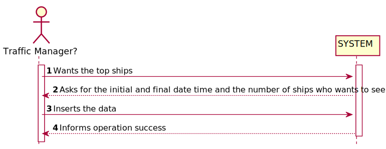
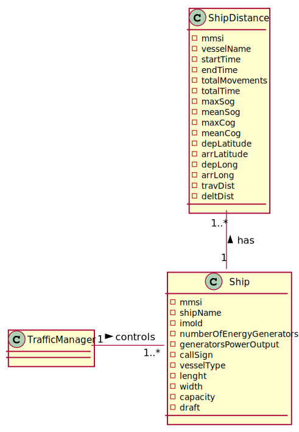
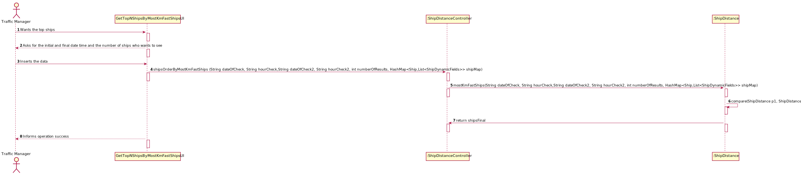
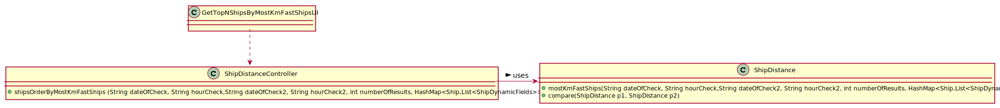

# US 106 - Get the top-N ships with the most kilometres travelled and their average speed(MeanSOG)

## 1. Requirements Engineering

### 1.1. User Story Description

Get the top-N ships with the most kilometres travelled and their average speed(MeanSOG)

### 1.2. Acceptance Criteria
- in a period (initial/final Base Date Time) grouped by Vessel Type.

### 1.3. Found out Dependencies
- US101
- US104

### 1.4 Input and Output Data

**Input Data:**

* Typed data:
    * initialTime
    * finalTime
    * numberOfShips

* Selected data:
    *

**Output Data:**

* (In)Success of the operation

### 1.5. System Sequence Diagram (SSD)

### 1.6 Other Relevant Remarks

## 2. OO Analysis

### 2.1. Relevant Domain Model Excerpt

### 2.2. Other Remarks

* n/a

## 3. Design - User Story Realization

### Systematization ##

According to the taken rationale, the conceptual classes promoted to software classes are:

* ShipDistance

Other software classes (i.e. Pure Fabrication) identified:

* GetTopNShipsByMostKmFastShipsUI
* ShipDistanceController

## 3.2. Sequence Diagram (SD)

## 3.3. Class Diagram (CD)

# 4. Tests

**Test 1:** **ShipDistanceControllerTest**

        @Test
        void checkShipsOrderByMostKmFast() throws FileNotFoundException {
        List<ShipDistance> result = ShipDistanceController.shipsOrderByMostKmFastShips(null, null, null, 0, shipMap);
        List<ShipDistance> expected = null;
        assertEquals(expected, result);
    }

# 5. Construction (Implementation)

## Class ShipDistanceController

            public static List<ShipDistance> shipsOrderByMostKmFastShips (String dateOfCheck, String hourCheck, String hourCheck2, int numberOfResults, HashMap<Ship,List<ShipDynamicFields>> shipMap) throws FileNotFoundException {
                 return ShipDistance.mostKmFastShips(dateOfCheck,hourCheck,hourCheck2,numberOfResults,shipMap);
            }

##Class ShipDistance

        public static List<ShipDistance> mostKmFastShips(String dateOfCheck, String hourCheck, String hourCheck2, int numberOfResults, HashMap<Ship,List<ShipDynamicFields>> shipMap) throws FileNotFoundException {
        int i = 0;
        List<ShipDistance> temp = new ArrayList<>();
        List<ShipDistance> shipsFinal = new ArrayList<>();
        if (dateOfCheck == null || hourCheck == null || hourCheck2 == null || numberOfResults == 0 || shipMap == null)
            return null;
        for (List<ShipDynamicFields> ship : shipMap.values()){
            for (ShipDynamicFields ships : ship) {
                String read[] = ships.getDateTime().split(" ");
                String diaAno = read[0];
                String hora = read[1];
                String read1[] = hora.split(":");
                int hour = Integer.parseInt(read1[0]);
                int minutes = Integer.parseInt(read1[1]);
                String read2[] = hourCheck.split(":");
                int hour1 = Integer.parseInt(read2[0]);
                int minutes1 = Integer.parseInt(read2[1]);
                String read3[] = hourCheck2.split(":");
                int hour2 = Integer.parseInt(read3[0]);
                int minutes2 = Integer.parseInt(read3[1]);
                if (diaAno.equals(dateOfCheck) && (hour >= hour1 && hour <= hour2 ) && (minutes >= minutes1 && minutes <= minutes2)) {
                    ShipDistance shipAdd = ShipDistanceController.shipDistCalc(ships.getMMSI(),shipMap);
                    String readEnd[] = shipAdd.getEndTime().split(" ");
                    String diaAnoEnd = readEnd[0];
                    String horaEnd = readEnd[1];
                    String read1End[] = horaEnd.split(":");
                    int hourEnd = Integer.parseInt(read1End[0]);
                    int minutesEnd = Integer.parseInt(read1End[1]);
                    if(diaAnoEnd.equals(dateOfCheck) && (hourEnd >= hour1 && hourEnd <= hour2 ) && (minutesEnd >= minutes1 && minutesEnd <= minutes2)) {
                        temp.add(shipAdd);
                    }
                }
            }
        }
        Collections.sort(temp, new Comparator<ShipDistance>() {
            @Override
            public int compare(ShipDistance p1, ShipDistance p2) {
                return (int) (p1.totalDistance(p1.getMmsi(),shipMap) - p2.totalDistance(p2.getMmsi(),shipMap));
            }
        });
        for (ShipDistance shipsF : temp){
            while(i!=numberOfResults){
                shipsFinal.add(shipsF);
                i++;
            }
        }
        return shipsFinal;
    }

# 6. Integration and Demo

* n/a

# 7. Observations

* n/a

