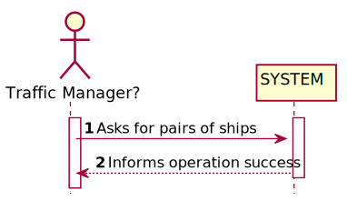
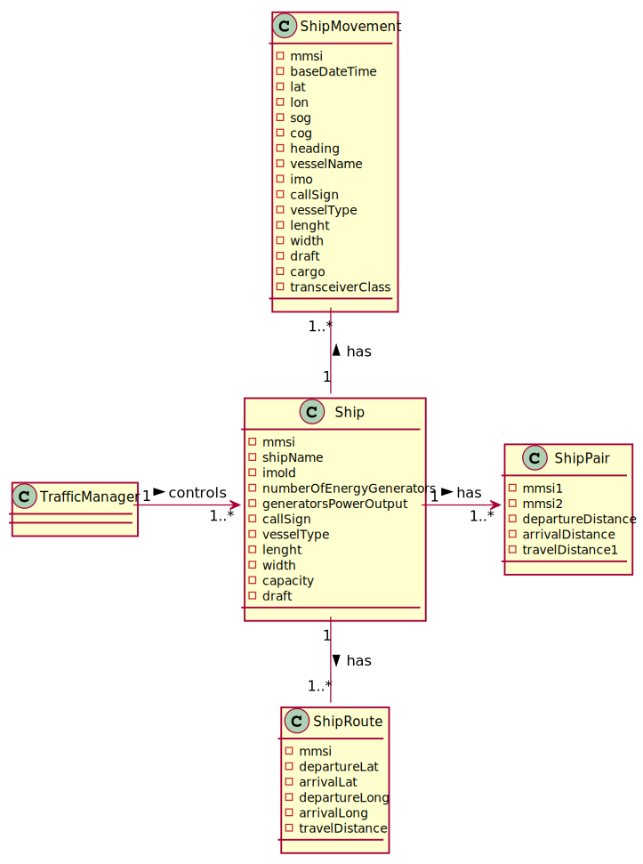
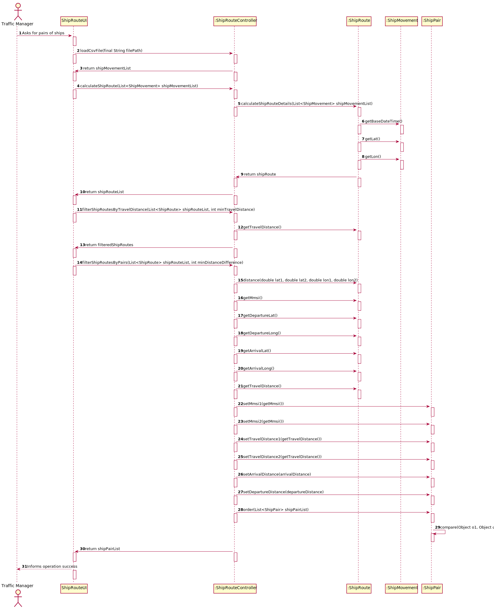
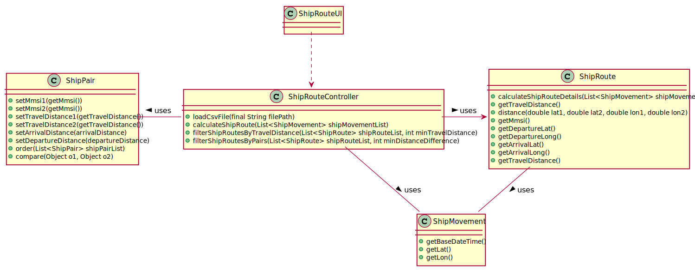

#US107 - Return pairs of ships with routes with close departure/arrival coordinates (no more than 5 Kms away) and with different Travelled Distance.

## 1. Requirements Engineering

### 1.1. User Story Description

Return pairs of ships with routes with close departure/arrival coordinates (no
more than 5 Kms away) and with different Travelled Distance.

### 1.2. Acceptance Criteria

Sorted by the MMSI code of the 1st ship and in descending order of the  Travelled Distance difference
Do not consider ships with Travelled Distance less than 10 kms.

### 1.3. Found out Dependencies
- US103
- US101
- US104

### 1.4 Input and Output Data

**Input Data:**

* Typed data:
    * N.A
    

* Selected data:
    *

**Output Data:**

* (In)Success of the operation

### 1.5. System Sequence Diagram (SSD)

### 1.6 Other Relevant Remarks

## 2. OO Analysis

### 2.1. Relevant Domain Model Excerpt

### 2.2. Other Remarks

* n/a

## 3. Design - User Story Realization

### Systematization ##

According to the taken rationale, the conceptual classes promoted to software classes are:

* ShipRoute
* ShipMovement
* ShipPair

Other software classes (i.e. Pure Fabrication) identified:

* ShipRouteUI
* ShipRouteController

## 3.2. Sequence Diagram (SD)

## 3.3. Class Diagram (CD)

# 4. Tests

**Test 1:** **ShipRouteControllerTest**

         @Test
         public void testShipPairs() throws FileNotFoundException {
         final int expectedPairs = 3;
         final ShipRouteController shipPairController = new ShipRouteController();
         final List<ShipRoute> shipRouteList = shipPairController.calculateShipRoute(shipMovementList);
         final List<ShipPair> shipPairList =  shipPairController.filterShipRoutesByPairs(shipRouteList, 5000);
         assertEquals(shipPairList.size(), expectedPairs);
         }

        @Test
        public void testShipfilter() throws FileNotFoundException {
        inal int expectedSize = 3;
        final ShipRouteController shipPairController = new ShipRouteController();
        final List<ShipRoute> shipRouteList = shipPairController.calculateShipRoute(shipMovementList);
        final List<ShipRoute> shipPairList =  shipPairController.filterShipRoutesByTravelDistance(shipRouteList,1000);
        assertEquals(shipPairList.size(), expectedSize);
        }

**ShipRouteTest**

        @Test
        void setMmsi() {
        ShipRoute shipRoute = new ShipRoute();
        int expected = 2;
        assertNotEquals(expected, shipRoute.getMmsi());
        shipRoute.setMmsi(2);
        assertEquals(expected, shipRoute.getMmsi());
        }

        @Test
        void setDepartureLat() {
        ShipRoute shipRoute = new ShipRoute();
        double expected = 2;
        assertNotEquals(expected, shipRoute.getDepartureLat());
        shipRoute.setDepartureLat(2);
        assertEquals(expected, shipRoute.getDepartureLat());
        }

        @Test
        void getMmsi() {
        ShipRoute ship = new ShipRoute();
        int mm = 0;
        int result = ship.getMmsi();
        assertEquals(mm,result);
        }

       @Test
       void getDepartureLat() {
       ShipRoute ship = new ShipRoute();
       double d = 0;
       double result = ship.getDepartureLat();
       assertEquals(d,result);
    }

    

# 5. Construction (Implementation)

## Class ShipRouteController

        public List<ShipRoute> calculateShipRoute(List<ShipMovement> shipMovementList) {
        final List<ShipRoute> shipRouteList = new ArrayList<>();
        final Map<Integer, List<ShipMovement>> shipMovementsByMMSI =shipMovementList
                 .stream()
                 .collect(Collectors.groupingBy(shipMovement -> shipMovement.getMmsi()));

        for (Map.Entry<Integer, List<ShipMovement>> pair : shipMovementsByMMSI.entrySet()) {
            shipRouteList.add(ShipRoute.calculateShipRouteDetails(pair.getValue()));
        }

        return shipRouteList;
    }

    public List<ShipRoute> filterShipRoutesByTravelDistance(List<ShipRoute> shipRouteList,
                                                            int minTravelDistance) {
        final List<ShipRoute> filteredShipRoutes = shipRouteList
                .stream()
                .filter(shipRoute -> shipRoute.getTravelDistance() > minTravelDistance)
                .collect(Collectors.toList());

        return filteredShipRoutes;
    }

    public List<ShipPair> filterShipRoutesByPairs(List<ShipRoute> shipRouteList, int minDistanceDifference){
        final List<ShipPair> shipPairList = new ArrayList<>();
        final List<Integer> checkedMmsi = new ArrayList<>();
        for (ShipRoute shipRoute1 : shipRouteList){
            for (ShipRoute shipRoute2 : shipRouteList){
                final boolean isNotSameShip = shipRoute1.getMmsi() != shipRoute2.getMmsi();
                final boolean alreadyCheckedShip =
                        checkedMmsi.contains(shipRoute1.getMmsi()) || checkedMmsi.contains(shipRoute2.getMmsi());
                if(isNotSameShip && !alreadyCheckedShip){
                    final double departureDistance = ShipRoute.distance(
                            shipRoute1.getDepartureLat(), shipRoute2.getDepartureLat(),
                            shipRoute1.getDepartureLong(), shipRoute2.getDepartureLong()
                    );
                    final double arrivalDistance = ShipRoute.distance(
                            shipRoute1.getArrivalLat(), shipRoute2.getArrivalLat(),
                            shipRoute1.getArrivalLong(), shipRoute2.getArrivalLong()
                    );
                    final boolean haveCloseRoutes = (arrivalDistance < minDistanceDifference) && (departureDistance < minDistanceDifference);
                    final boolean haveDifferentTravelDistance = shipRoute1.getTravelDistance() != shipRoute2.getTravelDistance();
                    final double travelDistanceDifferential = Math.abs(shipRoute1.getTravelDistance() - shipRoute2.getTravelDistance());
                    if (haveCloseRoutes && haveDifferentTravelDistance) {
                        final ShipPair shipPair = new ShipPair();
                        shipPair.setMmsi1(shipRoute1.getMmsi());
                        shipPair.setMmsi2(shipRoute2.getMmsi());
                        shipPair.setTravelDistance1(shipRoute1.getTravelDistance());
                        shipPair.setTravelDistance2(shipRoute2.getTravelDistance());
                        shipPair.setArrivalDistance(arrivalDistance);
                        shipPair.setDepartureDistance(departureDistance);
                        shipPair.setTravelDistanceDifferential(travelDistanceDifferential);

                        shipPairList.add(shipPair);
                    }
                }
            }
            checkedMmsi.add(shipRoute1.getMmsi());
        }
        ShipPair.order(shipPairList);
        return shipPairList;
    }

    public List<ShipMovement> loadCsvFile(final String filePath) throws FileNotFoundException {
        final List<ShipMovement> shipMovementList = new CsvToBeanBuilder(new FileReader(filePath))
                .withType(ShipMovement.class).build().parse();
        return shipMovementList;
    }

##Class ShipRoute

        public static ShipRoute calculateShipRouteDetails(List<ShipMovement> shipMovementList){
        final ShipRoute shipRoute = new ShipRoute();

        Date maxDate = new Date(0L);
        Date minDate = new Date(33193569834000L);

        double arrivalLong;
        double arrivalLat;
        double departureLong;
        double departureLat;
        double previousLat = 0L;
        double previousLong = 0L;
        double travelDistance = 0L;

        for (ShipMovement shipMovement : shipMovementList) {
            boolean verifyPreviousLat = (previousLat == 0L);
            boolean verifyPreviousLong = (previousLong == 0L);

            final Date movementDate = shipMovement.getBaseDateTime();

            if(verifyPreviousLat && verifyPreviousLong){
                previousLat = shipMovement.getLat();
                previousLong= shipMovement.getLon();
                shipRoute.setMmsi(shipMovement.getMmsi());
            }
            if (maxDate.before(movementDate)){
                maxDate = movementDate;
                arrivalLat= shipMovement.getLat();
                shipRoute.setArrivalLat(arrivalLat);
                arrivalLong= shipMovement.getLon();
                shipRoute.setArrivalLong(arrivalLong);
            }
            if (minDate.after(movementDate)){
                minDate = movementDate;
                departureLat = shipMovement.getLat();
                shipRoute.setDepartureLat(departureLat);
                departureLong = shipMovement.getLon();
                shipRoute.setDepartureLong(departureLong);
            }

            travelDistance = travelDistance + distance(shipMovement.getLat(), previousLat, shipMovement.getLon(), previousLong);
            previousLat = shipMovement.getLat();
            previousLong= shipMovement.getLon();

        }
        shipRoute.setTravelDistance(travelDistance);
        return shipRoute;
    }

    public static double distance(
            double lat1, double lat2, double lon1, double lon2
    ) {

        final int R = 6371; // Radius of the earth

        double latDistance = Math.toRadians(lat2 - lat1);
        double lonDistance = Math.toRadians(lon2 - lon1);
        double a = Math.sin(latDistance / 2) * Math.sin(latDistance / 2)
                + Math.cos(Math.toRadians(lat1)) * Math.cos(Math.toRadians(lat2))
                * Math.sin(lonDistance / 2) * Math.sin(lonDistance / 2);
        double c = 2 * Math.atan2(Math.sqrt(a), Math.sqrt(1 - a));
        double distance = R * c * 1000; // convert to meters

        distance = Math.pow(distance, 2);

        return Math.sqrt(distance);
    }

# 6. Integration and Demo

* n/a

# 7. Observations

* n/a

