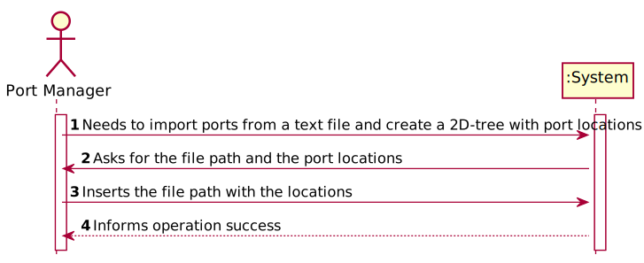
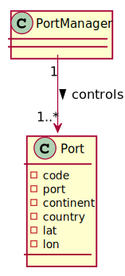
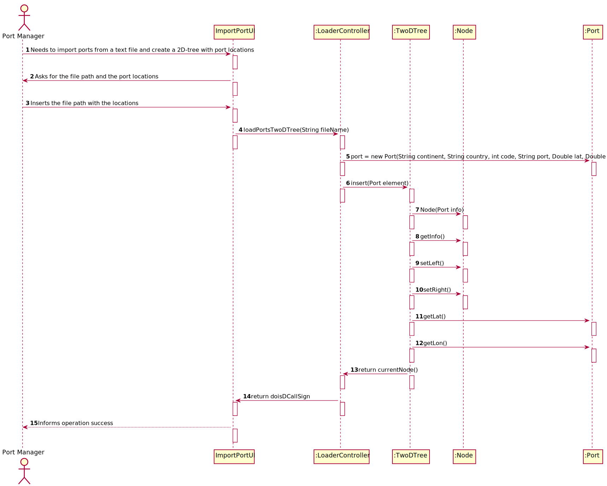
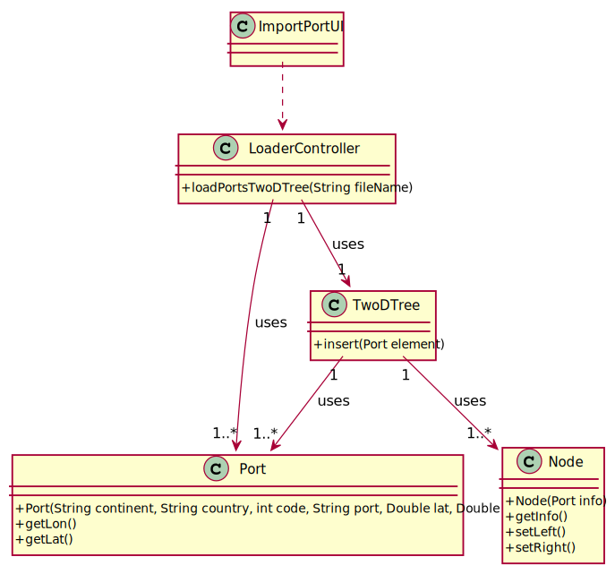

# US 201 - To import ports from a text file  and create a 2D-tree with port locations.

## 1. Requirements Engineering

### 1.1. User Story Description

As a Port manager, I which to import ports from a text file and create a 2D-tree with port locations.

### 1.2. Acceptance Criteria
-  2D-tree balanced

### 1.4. Found out Dependencies

N.A.

### 1.5 Input and Output Data

**Input Data:**

* Typed data:
    *   fileName
    *
    *

* Selected data:
    *   fileName

**Output Data:**

* (In)Success of the operation

### 1.6. System Sequence Diagram (SSD)

### 1.7 Other Relevant Remarks

## 2. OO Analysis

### 2.1. Relevant Domain Model Excerpt

### 2.2. Other Remarks

* n/a

### Systematization ##

According to the taken rationale, the conceptual classes promoted to software classes are:

* Ship
* TwoDTree
* Node
* Port

Other software classes (i.e. Pure Fabrication) identified:

* ImportPortUI
* LoaderController

## 3.2. Sequence Diagram (SD)

## 3.3. Class Diagram (CD)

# 4. Tests

**Test 1:** Tests of gets and sets of the class Port

            @Test
    void getContinent() throws FileNotFoundException {
        Port port = new Port("Europe", "Portugal", 500000000, "Travel", 55d, 65d);
        String result = port.getContinent();
        String expected = "Europe";
        assertEquals(result, expected);
    }

    @Test
    void getCountry() throws FileNotFoundException {
        Port port = new Port("Europe", "Portugal", 500000000, "Travel", 55d, 65d);
        String result = port.getCountry();
        String expected = "Portugal";
        assertEquals(result, expected);
    }

    @Test
    void getCode() throws FileNotFoundException {
        Port port = new Port("Europe", "Portugal", 500000000, "Travel", 55d, 65d);
        int result = port.getCode();
        int expected = 500000000;
        assertEquals(result, expected);
    }

    @Test
    void getPort() throws FileNotFoundException {
        Port port = new Port("Europe", "Portugal", 500000000, "Travel", 55d, 65d);
        String result = port.getPort();
        String expected = "Travel";
        assertEquals(result, expected);
    }

    @Test
    void setContinent() {
        Port port = new Port("Europe", "Portugal", 500000000, "Travel", 55d, 65d);
        String expected = "Africa";
        assertNotEquals(expected, port.getContinent());
        port.setContinent("Africa");
        assertEquals(expected, port.getContinent());
    }

    @Test
    void setCountry() {
        Port port = new Port("Europe", "Portugal", 500000000, "Travel", 55d, 65d);
        String expected = "France";
        assertNotEquals(expected, port.getCountry());
        port.setCountry("France");
        assertEquals(expected, port.getCountry());
    }

    @Test
    void setCode() {
        Port port = new Port("Europe", "Portugal", 500000000, "Travel", 55d, 65d);
        int expected = 5666666;
        assertNotEquals(expected, port.getCode());
        port.setCode(5666666);
        assertEquals(expected, port.getCode());
    }

    @Test
    void setPort() {
        Port port = new Port("Europe", "Portugal", 500000000, "Travel", 55d, 65d);
        String expected = "reel";
        assertNotEquals(expected, port.getPort());
        port.setPort("reel");
        assertEquals(expected, port.getPort());
    }

    @Test
    void setLat() {
        Port port = new Port("Europe", "Portugal", 500000000, "Travel", 55d, 65d);
        Double expected = 555d;
        assertNotEquals(expected, port.getLat());
        port.setLat(555d);
        assertEquals(expected, port.getLat());
    }

    @Test
    void setLon() {
        Port port = new Port("Europe", "Portugal", 500000000, "Travel", 55d, 65d);
        Double expected = 555d;
        assertNotEquals(expected, port.getLon());
        port.setLon(555d);
        assertEquals(expected, port.getLon());
    }

# 5. Construction (Implementation)

## Class LoaderController

         public static TwoDTree<Port> loadPortsTwoDTree(String fileName) throws FileNotFoundException {
        TwoDTree<Port> doisDCallSign = new TwoDTree<>();
        File file = new File(fileName);

        Scanner in = new Scanner(file);
        String line = in.nextLine();

        while (in.hasNextLine()) {
            String read[] = in.nextLine().trim().split(",");
            Port port = new Port(read[0],read[1],Integer.parseInt(read[2]),read[3],Double.parseDouble(read[4]),Double.parseDouble(read[5]));
            doisDCallSign.insert(port);
        }
        return doisDCallSign;
    }

## Class Port
       public Port(String continent, String country, int code, String port, Double lat, Double lon) {
        this.continent = continent;
        this.country = country;
        this.code = code;
        this.port = port;
        this.lat = lat;
        this.lon = lon;
    }

        public String getContinent() {
        return continent;
    }

    public String getCountry() {
        return country;
    }

    public int getCode() {
        return code;
    }

    public String getPort() {
        return port;
    }

    public Double getLat() {
        return lat;
    }

    public Double getLon() {
        return lon;
    }

    public void setContinent(String continent) {
        this.continent = continent;
    }

    public void setCountry(String country) {
        this.country = country;
    }

    public void setCode(int code) {
        this.code = code;
    }

    public void setPort(String port) {
        this.port = port;
    }

    public void setLat(Double lat) {
        this.lat = lat;
    }

    public void setLon(Double lon) {
        this.lon = lon;
    }

# 6. Integration and Demo

* n/a

# 7. Observations

* n/a

