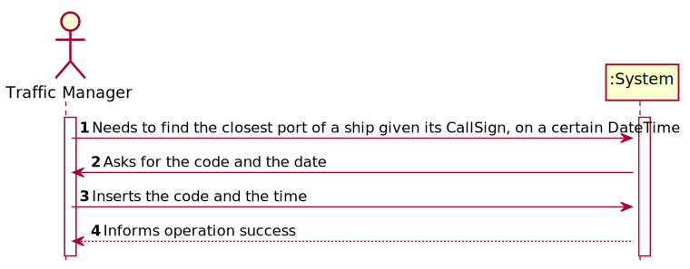
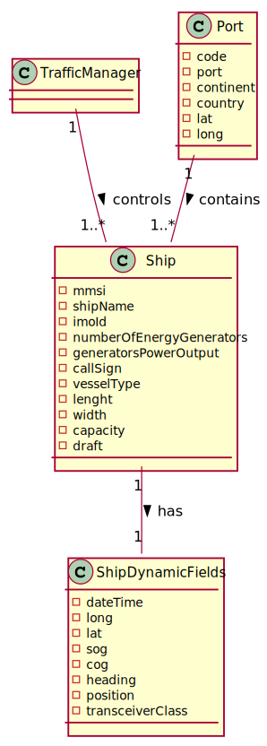
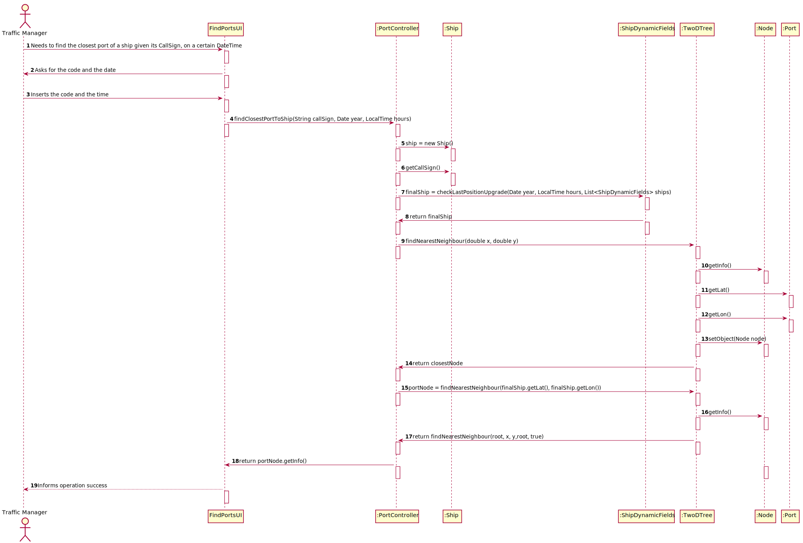
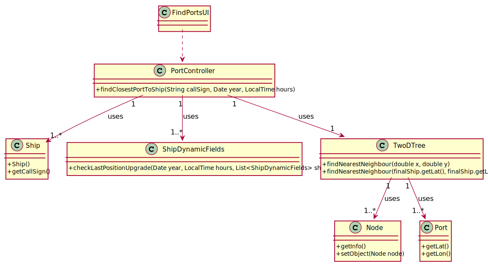

# US 202 - To find the closest port of a ship given its CallSign, on a certain DateTime.

## 1. Requirements Engineering

### 1.1. User Story Description

As a Traffic manager, I which to find the closest port of a ship given its CallSign,
on a certain DateTime.

### 1.2. Acceptance Criteria
- using 2D-tree to find the closest port

### 1.4. Found out Dependencies

US201

### 1.5 Input and Output Data

**Input Data:**

* Typed data:
    *   code
    *   time
    *

* Selected data:
    *   code
    *   time

**Output Data:**

* (In)Success of the operation

### 1.6. System Sequence Diagram (SSD)

### 1.7 Other Relevant Remarks

## 2. OO Analysis

### 2.1. Relevant Domain Model Excerpt

### 2.2. Other Remarks

* n/a

### Systematization ##

According to the taken rationale, the conceptual classes promoted to software classes are:

* Ship
* ShipDynamicFields
* TwoDTree
* Port
* Node

Other software classes (i.e. Pure Fabrication) identified:

* FindPortsUI
* PortController

## 3.2. Sequence Diagram (SD)

## 3.3. Class Diagram (CD)

# 4. Tests

**Test 1:** Tests for the class PortControllerTest

          @Test
    void findClosestPortToShip() throws ParseException, FileNotFoundException {
        SimpleDateFormat sdf = new SimpleDateFormat("dd/MM/yyyy", Locale.ENGLISH);
        Date year = sdf.parse("31/12/2020");
        LocalTime hours = LocalTime.parse("17:17");
        String callSign = "C4SQ2";
        Port result = new PortController().findClosestPortToShip(callSign, year, hours);
        Port expected = new Port("America", "Canada", 22226, "Halifax", 44.65, -63.56666667);

       assertEquals(result, expected);
    }
}

# 5. Construction (Implementation)

## Class PortController

         public Port findClosestPortToShip(String callSign, Date year, LocalTime hours) throws FileNotFoundException, ParseException {
        Ship ship = new Ship();
        for(Ship ships : shipMaptest.keySet()) {
            if (ships.getCallSign().equals(callSign)) {
                 ship = ships;
            }
        }
        List<ShipDynamicFields> shipDynamicFields = shipMaptest.get(ship);
        ShipDynamicFields finalShip =ShipDynamicFields.checkLastPositionUpgrade(year, hours, shipDynamicFields);
        Node portNode = portstest.findNearestNeighbour(finalShip.getLat(), finalShip.getLon());
        return portNode.getInfo();
    }
## Class ShipDynamicFields
         public static ShipDynamicFields checkLastPositionUpgrade(Date year, LocalTime hours, List<ShipDynamicFields> ships) throws FileNotFoundException, ParseException {
        ShipDynamicFields finalShip = null;
        SimpleDateFormat sdf = new SimpleDateFormat("dd/MM/yyyy", Locale.ENGLISH);
        int minHoras = 99999;
        int minMinutes = 99999;
        long minDias = 99999;
        int difHoras;
        int difMinutos;
        long difDias;

                for (ShipDynamicFields shipDynamicFields : ships) {
                        String read[] = shipDynamicFields.getDateTime().split(" ");
                        String diaAno = read[0];
                        Date ano = sdf.parse(diaAno);
                        LocalTime hora = LocalTime.parse(read[1]);
                        difHoras = hours.getHour()-hora.getHour();
                        difMinutos =hours.getMinute() - hora.getMinute();
                        long dif = Math.abs(year.getTime() -ano.getTime());
                        difDias = TimeUnit.DAYS.convert(dif, TimeUnit.MILLISECONDS);
                        if(difHoras==0 && difMinutos == 0 && difDias ==0){
                            finalShip = shipDynamicFields;
                            return finalShip;
                        }
                    if (difMinutos < 0) {
                        difHoras = difHoras - 1;
                        difMinutos = 60 + difMinutos;
                    }
                        if (difHoras <= minHoras && difHoras >= 0 && difDias >=0 && difDias <= minDias) {
                                if (difHoras < minHoras) {
                                    minHoras = difHoras;
                                    minMinutes = difMinutos;
                                    minDias = difDias;
                                    finalShip = shipDynamicFields;
                                }
                                if (difHoras == minHoras && difMinutos<minMinutes && difDias >=0 && difDias <= minDias) {
                                    minHoras = difHoras;
                                    minMinutes =difMinutos;
                                    minDias = difDias;
                                    finalShip = shipDynamicFields;
                                }
                            } else {
                                minHoras = difHoras;
                                minMinutes = difMinutos;
                                minDias = difDias;
                                finalShip = shipDynamicFields;
                            }
                        }

        return finalShip;
    }
# 6. Integration and Demo

* n/a

# 7. Observations
*n/a