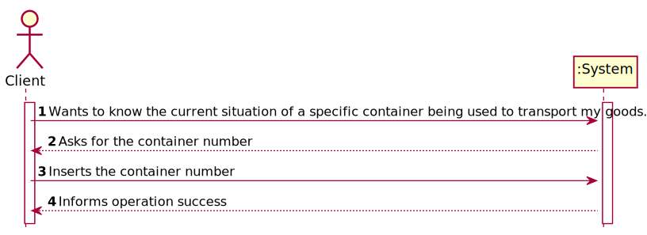
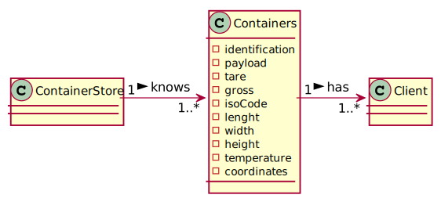
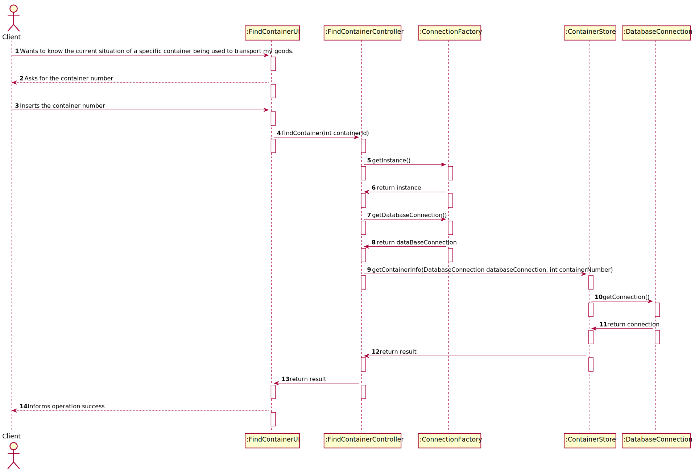
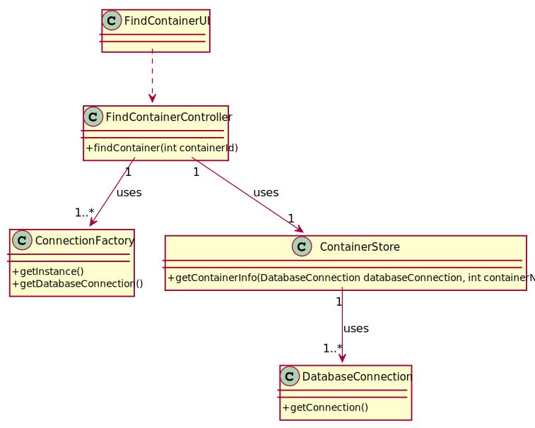

# US 204 - To know the current situation of a specific container being used to transport my goods.

## 1. Requirements Engineering

### 1.1. User Story Description

As Client, I want to know the current situation of a specific container being used to transport my goods.

### 1.2. Acceptance Criteria
- Clients provide the container identifier and get the type and the concrete
  instance of its current location, e.g., PORT, Leixões or SHIP, WeFly.

### 1.4. Found out Dependencies

US203 

### 1.5 Input and Output Data

**Input Data:**

* Typed data:
    *   containerId
    *
    *

* Selected data:
    *   containerId

**Output Data:**

* (In)Success of the operation

### 1.6. System Sequence Diagram (SSD)

### 1.7 Other Relevant Remarks

## 2. OO Analysis

### 2.1. Relevant Domain Model Excerpt

### 2.2. Other Remarks

* n/a

### Systematization ##

According to the taken rationale, the conceptual classes promoted to software classes are:

* ConnectionFactory
* ContainerStore
* DatabaseConnection

Other software classes (i.e. Pure Fabrication) identified:

* FindContainerUI
* FindContainerController

## 3.2. Sequence Diagram (SD)

## 3.3. Class Diagram (CD)

# 4. Tests

**Test 1:** Tests of gets and sets of the class Port

            @Test
    void getContinent() throws FileNotFoundException {
        Port port = new Port("Europe", "Portugal", 500000000, "Travel", 55d, 65d);
        String result = port.getContinent();
        String expected = "Europe";
        assertEquals(result, expected);
    }

    @Test
    void getCountry() throws FileNotFoundException {
        Port port = new Port("Europe", "Portugal", 500000000, "Travel", 55d, 65d);
        String result = port.getCountry();
        String expected = "Portugal";
        assertEquals(result, expected);
    }

    @Test
    void getCode() throws FileNotFoundException {
        Port port = new Port("Europe", "Portugal", 500000000, "Travel", 55d, 65d);
        int result = port.getCode();
        int expected = 500000000;
        assertEquals(result, expected);
    }

    @Test
    void getPort() throws FileNotFoundException {
        Port port = new Port("Europe", "Portugal", 500000000, "Travel", 55d, 65d);
        String result = port.getPort();
        String expected = "Travel";
        assertEquals(result, expected);
    }

    @Test
    void setContinent() {
        Port port = new Port("Europe", "Portugal", 500000000, "Travel", 55d, 65d);
        String expected = "Africa";
        assertNotEquals(expected, port.getContinent());
        port.setContinent("Africa");
        assertEquals(expected, port.getContinent());
    }

    @Test
    void setCountry() {
        Port port = new Port("Europe", "Portugal", 500000000, "Travel", 55d, 65d);
        String expected = "France";
        assertNotEquals(expected, port.getCountry());
        port.setCountry("France");
        assertEquals(expected, port.getCountry());
    }

    @Test
    void setCode() {
        Port port = new Port("Europe", "Portugal", 500000000, "Travel", 55d, 65d);
        int expected = 5666666;
        assertNotEquals(expected, port.getCode());
        port.setCode(5666666);
        assertEquals(expected, port.getCode());
    }

    @Test
    void setPort() {
        Port port = new Port("Europe", "Portugal", 500000000, "Travel", 55d, 65d);
        String expected = "reel";
        assertNotEquals(expected, port.getPort());
        port.setPort("reel");
        assertEquals(expected, port.getPort());
    }

    @Test
    void setLat() {
        Port port = new Port("Europe", "Portugal", 500000000, "Travel", 55d, 65d);
        Double expected = 555d;
        assertNotEquals(expected, port.getLat());
        port.setLat(555d);
        assertEquals(expected, port.getLat());
    }

    @Test
    void setLon() {
        Port port = new Port("Europe", "Portugal", 500000000, "Travel", 55d, 65d);
        Double expected = 555d;
        assertNotEquals(expected, port.getLon());
        port.setLon(555d);
        assertEquals(expected, port.getLon());
    }

# 5. Construction (Implementation)

## Class FindContainerController

         public void findContainer(int containerId){
        DatabaseConnection databaseConnection = null;
        try {
            databaseConnection = ConnectionFactory.getInstance()
                    .getDatabaseConnection();
            ContainerStore containerStore = new ContainerStore();
            System.out.println(containerStore.getContainerInfo(databaseConnection, containerId));
        } catch (IOException | SQLException exception) {
            System.out.println("IOException");
        }

    }

# 6. Integration and Demo

* n/a

# 7. Observations

* n/a

