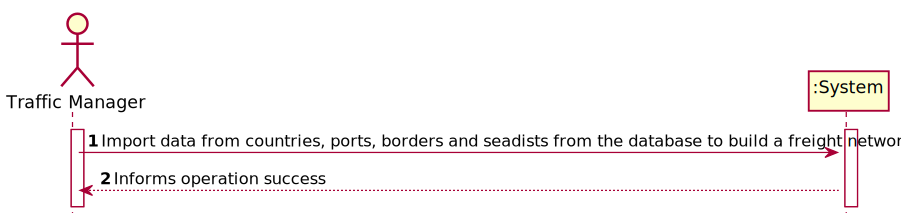
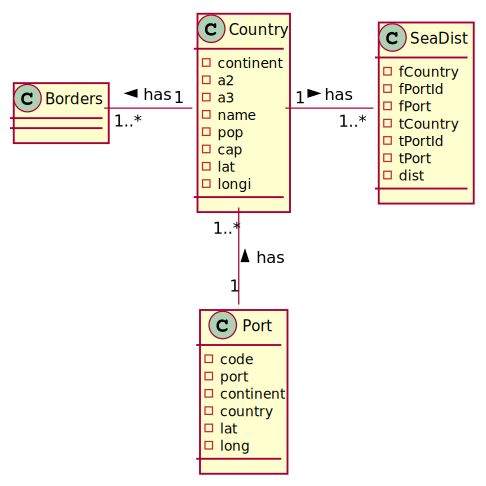
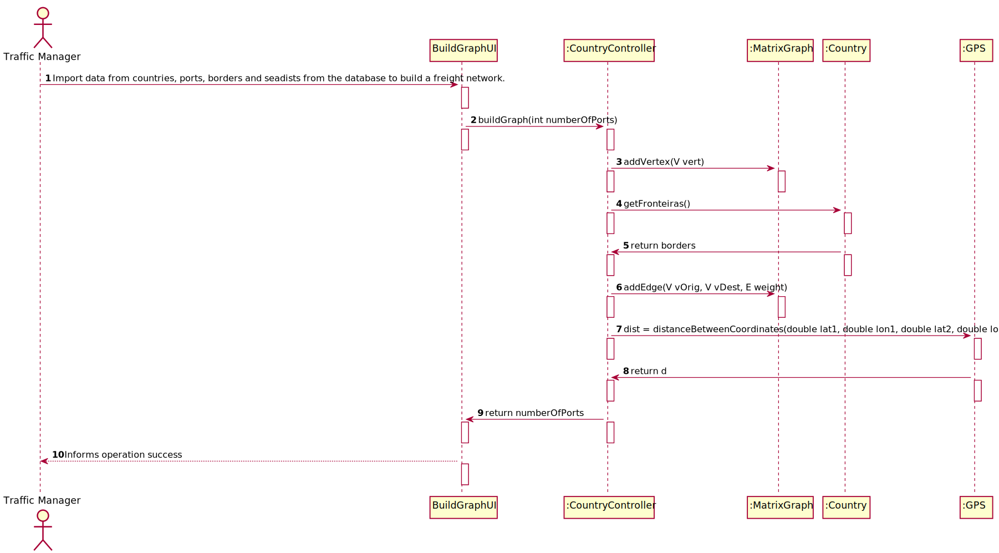
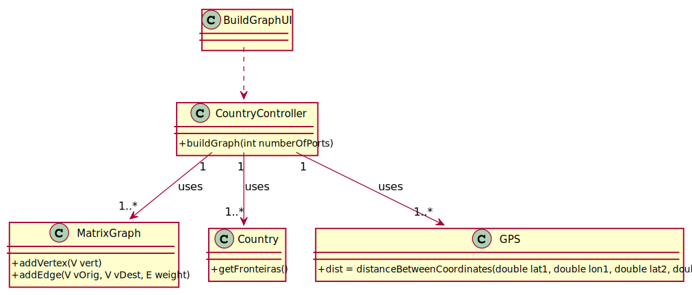

# US 301 - To import data from countries, ports, borders and seadists from the database to build a freight network

## 1. Requirements Engineering

### 1.1. User Story Description

As a Traffic manager, I which to import data from countries, ports, borders and seadists from the database to build a freight network

### 1.2. Acceptance Criteria
- The capital of a country has a direct connection with the capitals of the countries with which it borders. The ports of a country, besides 2021/2022. This document is no longer valid once printed. Connecting with all the ports of the same country, the port closest to the capital of the country connects with it; and finally, each port of a country connects with the n the closest ports of any other country
- The calculation of distances in Kms between capitals, and ports and capitals must be done using the GPS coordinates.
- The graph must be implemented using the adjacency matrix representation and ensuring the indistinct manipulation of capitals and seaports.

### 1.4. Found out Dependencies

*N.A.*

### 1.5 Input and Output Data

**Input Data:**

* Typed data:
  *N.A.*

* Selected data:
  *N.A.*

**Output Data:**

* (In)Success of the operation

### 1.6. System Sequence Diagram (SSD)

### 1.7 Other Relevant Remarks

## 2. OO Analysis

### 2.1. Relevant Domain Model Excerpt

### 2.2. Other Remarks

*N.A.*

### Systematization ##

According to the taken rationale, the conceptual classes promoted to software classes are:

* MatrixGraph
* Country
* GPS

Other software classes (i.e. Pure Fabrication) identified:

* BuildGraphUI
* CountryController

## 3.2. Sequence Diagram (SD)

## 3.3. Class Diagram (CD)

# 4. Tests

## Class CountryControllerTest

        @Test
    void setMatrixGraph() {
        MatrixGraph<String, Double> matrix = countryC.getMatrix();
        countryC.setMatrixGraph(completeMapClone);
        matrix.equals(completeMapClone);
    }

    @Test
    void buildGraph() throws FileNotFoundException {
        countryC.buildGraph(2);
        MatrixGraph<String,Double> res= countryC.getMatrixGraph();
        MatrixGraph<String,Double> exp = new MatrixGraph<>(false);
        exp.addVertex("Lisbon");
        exp.addVertex("Madrid");
        exp.addVertex("Paris");
        exp.addVertex("Leixoes");
        exp.addVertex("Setubal");
        exp.addVertex("Barcelona");
        exp.addVertex("Horta");
        exp.addVertex("Ponta Delgada");
        exp.addVertex("Valencia");
        exp.addVertex("Funchal");
        exp.addEdge("Lisbon", "Madrid",503206.50841593044 );
        exp.addEdge("Madrid", "Paris", 1054165.6571748783);
        exp.addEdge("Leixoes", "Barcelona", 907905.0641587445);
        exp.addEdge("Leixoes", "Setubal", 298945.61008204427);
        exp.addEdge("Leixoes", "Ponta Delgada", 1503559.016783181);
        exp.addEdge("Leixoes", "Funchal", 1196220.2266439092);
        exp.addEdge("Leixoes", "Horta", 1721420.6564798946);
        exp.addEdge("Leixoes", "Barcelona",907905.0641587445);
        exp.addEdge("Barcelona", "Valencia", 295770.089409461);
        exp.addEdge("Lisbon", "Horta",1689456.1161494716);
        exp.addEdge("Barcelona", "Madrid",502644.56016177934);
        exp.addEdge("Horta", "Setubal",1710645.7302179313);
        exp.addEdge("Funchal", "Ponta Delgada",974824.0114952982);
        exp.addEdge("Setubal", "Horta",1710645.7302179313);
        exp.addEdge("Ponta Delgada", "Horta",272904.8012705913);
        assertEquals(res, exp);
    }

# 5. Construction (Implementation)

## Class CountryController

         public void buildGraph(int numberOfPorts) throws FileNotFoundException {
        lstCountry = LoaderController.loadCountry("countries.csv");
        lstDist = LoaderController.loadDist("seadists.csv");
        LoaderController.loadBorders("borders.csv", lstCountry);
        lstPorts = LoaderController.loadPorts( "bports.csv");
        HashMap<Country, List<Port>> map = LoaderController.mapPortCountry(lstCountry, lstPorts);
        for(Country cnt : lstCountry){
            matrixGraph.addVertex(cnt.getCap());
            for(Country cnt2 : cnt.getFronteiras()) {
                matrixGraph.addEdge(cnt.getCap(), cnt2.getCap(), GPS.distanceBetweenCoordinates(cnt.getLat(),cnt.getLongi(),cnt2.getLat(),cnt2.getLongi()));
            }
        }
        for (Port port : lstPorts) {
                matrixGraph.addVertex(port.getPort());
        }
        for(Country c: map.keySet()){
            List<Port> aux = map.get(c);
            HashMap<String, Double> aux3 = new HashMap<>();
            for(int i = 0; i<aux.size()-1; i++){
                matrixGraph.addEdge(aux.get(i).getPort(), aux.get(i+1).getPort(), GPS.distanceBetweenCoordinates(aux.get(i).getLat(),aux.get(i).getLon(),aux.get(i+1).getLat(),aux.get(i+1).getLon()));
            }
            for(Port port : aux){
                double dist = GPS.distanceBetweenCoordinates(c.getLat(), c.getLongi(), port.getLat(), port.getLon());
                aux3.put(port.getPort(), dist);

            }
            sortByValue(aux3);
            for(String ports : aux3.keySet()) {
                matrixGraph.addEdge(c.getCap(), ports, aux3.get(ports));
                break;
            }
        }

        for(Port port : lstPorts){
            HashMap<String, Double> aux = new HashMap<>();
            for (Port ports : lstPorts) {
                if (port.getCountry() != ports.getCountry()) {
                    double dist = GPS.distanceBetweenCoordinates(port.getLat(), port.getLon(), ports.getLat(), ports.getLon());
                    aux.put(ports.getPort(),dist);
                }
            }
            sortByValue(aux);
            for(String key : aux.keySet()){
                if(numberOfPorts<=0){break;}
                matrixGraph.addEdge(port.getPort(), key, aux.get(key));
                numberOfPorts--;
            }
        }
    }

## Class MatrixGraph
        @Override
    public boolean addEdge(V vOrig, V vDest, E weight) {
        if (vOrig == null || vDest == null) throw new RuntimeException("Vertices cannot be null!");
        if (edge(vOrig, vDest) != null)
            return false;

        if (!validVertex(vOrig))
            addVertex(vOrig);

        if (!validVertex(vDest))
            addVertex(vDest);

        int vOrigKey = key(vOrig);
        int vDestKey = key(vDest);

        edgeMatrix[vOrigKey][vDestKey] = new Edge<>(vOrig, vDest, weight );
        numEdges++;
        if (!isDirected) {
            edgeMatrix[vDestKey][vOrigKey] = new Edge<>(vDest, vOrig, weight );
            numEdges++;
        }
        return true;
    }

    @Override
    public boolean addVertex(V vert) {
        int vertKey = key(vert);
        if (vertKey != -1)
            return false;

        vertices.add(vert);
        numVerts++;
        resizeMatrix();
        return true;
    }

## Class GPS

    public class GPS {
    public static double distanceBetweenCoordinates(double lat1, double lon1, double lat2, double lon2) {
        double radius = 6371e3;
        double lat1rad = Math.toRadians(lat1);
        double lat2rad = Math.toRadians(lat2);

        double varLat = Math.toRadians(lat2 - lat1);
        double varLon = Math.toRadians(lon2 - lon1);

        double a = Math.sin(varLat / 2) * Math.sin(varLat / 2)
                + Math.cos(lat1rad) * Math.cos(lat2rad)
                * Math.sin(varLon / 2) * Math.sin(varLon / 2);
        double c = 2 * Math.atan2(Math.sqrt(a), Math.sqrt(1 - a));

        double d = radius * c;

        return d;
    }
}

## Class Country

    public Set<Country> getFronteiras() {
        return this.borders;
    }

# 6. Integration and Demo

*N.A.*

# 7. Observations

*N.A.*

