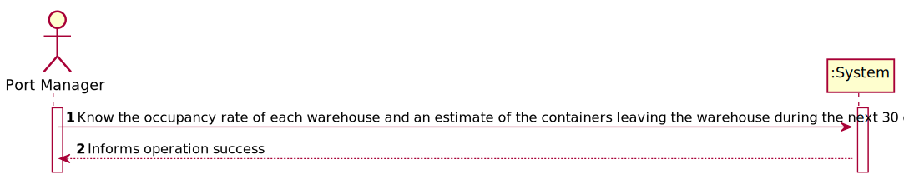
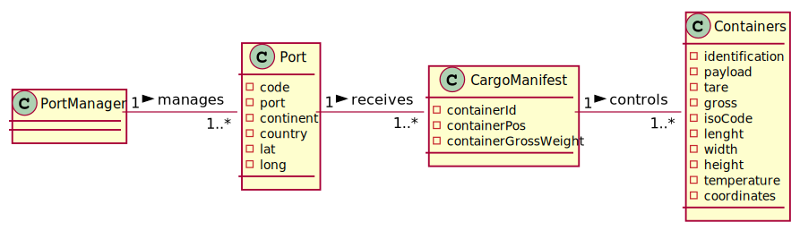
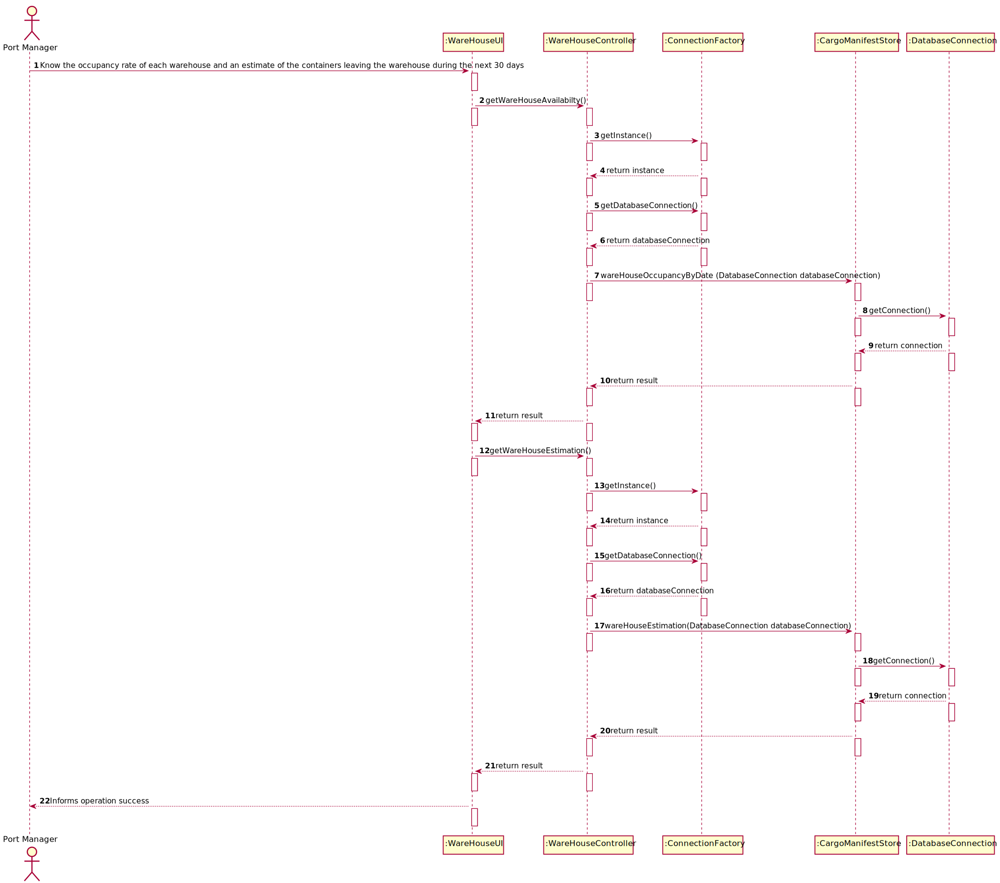
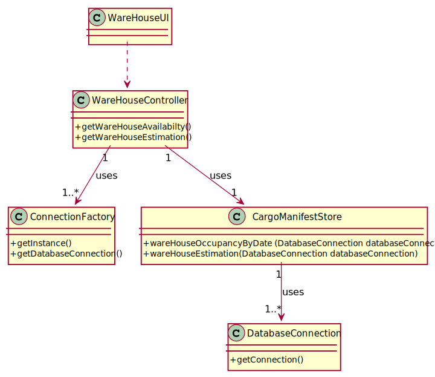

# US 306 - Know the occupancy rate of each warehouse and an estimate of the containers leaving the warehouse during the next 30 days

## 1. Requirements Engineering

### 1.1. User Story Description

As Port manager, I want to know the occupancy rate of each warehouse and an estimate of the containers leaving the warehouse during the next 30 days

### 1.2. Acceptance Criteria
- For each warehouse the required output is available
- The 30 days period is properly considered

### 1.4. Found out Dependencies

US301

### 1.5 Input and Output Data

**Input Data:**

* Typed data:
    *N.A.*
    

* Selected data:
    *N.A.*

**Output Data:**

* (In)Success of the operation

### 1.6. System Sequence Diagram (SSD)

### 1.7 Other Relevant Remarks

## 2. OO Analysis

### 2.1. Relevant Domain Model Excerpt

### 2.2. Other Remarks

*N.A.*

### Systematization ##

According to the taken rationale, the conceptual classes promoted to software classes are:

* ConnectionFactory
* CargoManifestStore
* DatabaseConnection

Other software classes (i.e. Pure Fabrication) identified:

* WareHouseUI
* WareHouseController

## 3.2. Sequence Diagram (SD)

## 3.3. Class Diagram (CD)

# 4. Tests

*N.A.*
# 5. Construction (Implementation)

## Class WareHouseController

         public String getWareHouseAvailabilty() throws IOException, SQLException {
        String result="";
        DatabaseConnection databaseConnection = null;

        databaseConnection = ConnectionFactory.getInstance()
                .getDatabaseConnection();
        CargoManifestStore cargoManifestStore = new CargoManifestStore();
        result=cargoManifestStore.wareHouseOccupancyByDate(databaseConnection);

        return result;
    }

    public String getWareHouseEstimation() throws IOException {
        String result="";
        DatabaseConnection databaseConnection = null;

        databaseConnection = ConnectionFactory.getInstance()
                .getDatabaseConnection();
        CargoManifestStore cargoManifestStore = new CargoManifestStore();
        result=cargoManifestStore.wareHouseEstimation(databaseConnection);

        return result;
    }

## Class CargoManifestStore
       public String wareHouseOccupancyByDate (DatabaseConnection databaseConnection) throws SQLException {
        Connection connection = databaseConnection.getConnection();
        String result="";
        try (CallableStatement callfunctions = connection.prepareCall("{?=call fnc_wareHouseOccupancyRate()}")){
            callfunctions.registerOutParameter(1, OracleTypes.CURSOR);
            callfunctions.execute();
            try (ResultSet resultSet =(ResultSet) callfunctions.getObject(1)) {
                while (resultSet.next()){;
                    result += String.format("%10s" + "%10s", resultSet.getInt(1), resultSet.getInt(2) + "\n");
                }
            }
            return result;
        }catch (SQLException tt){tt.printStackTrace();}
        return null;
    }

        public String wareHouseEstimation(DatabaseConnection databaseConnection) {
        Connection connection = databaseConnection.getConnection();
        String result="";
        try (CallableStatement callfunctions = connection.prepareCall("{?=call fnc_wareHouseContainerEstimate()}")){
            callfunctions.registerOutParameter(1, OracleTypes.CURSOR);
            callfunctions.execute();
            try (ResultSet resultSet =(ResultSet) callfunctions.getObject(1)) {
                while (resultSet.next()){;
                    result += String.format("%10s" + "%10s", resultSet.getInt(1), resultSet.getInt(2) + "\n");
                }
            }
            return result;
        }catch (SQLException tt){tt.printStackTrace();}
        return null;
    }

# 6. Integration and Demo

*N.A.*

# 7. Observations

*N.A.*

