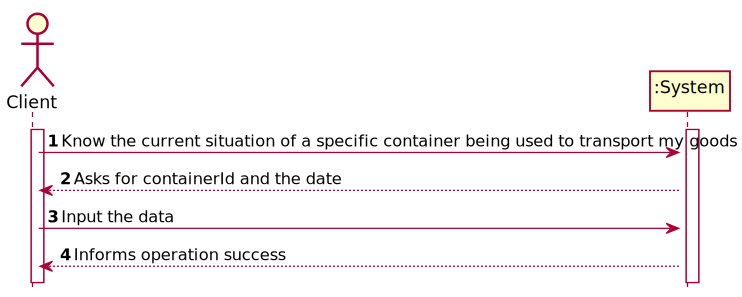
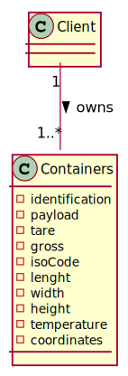
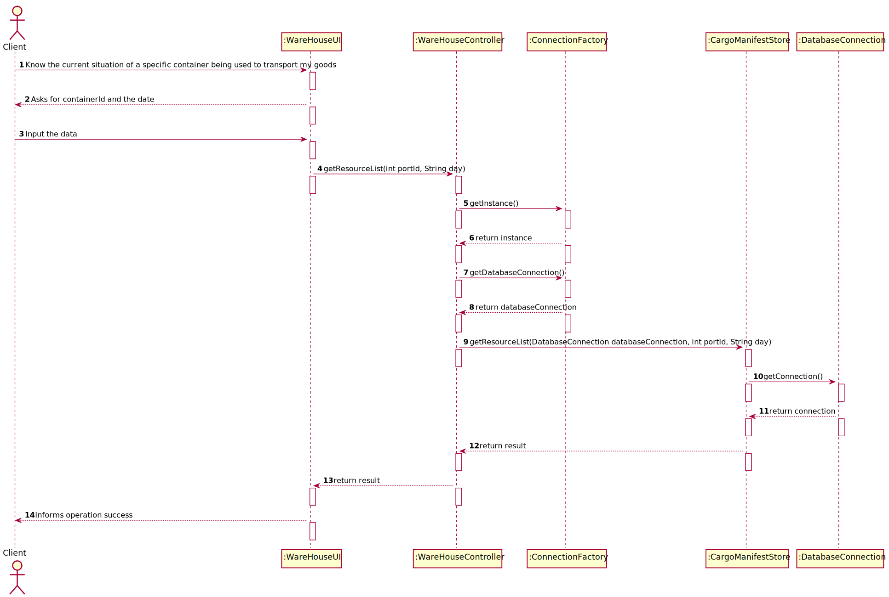
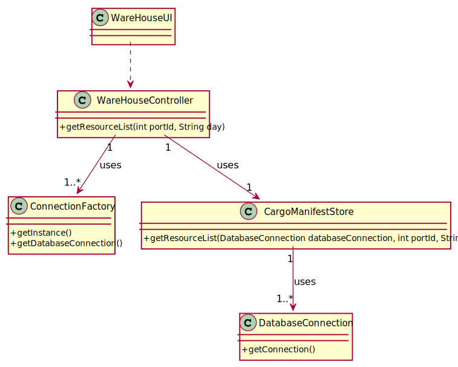

# US 312 - Know the current situation of a specific container being used to transport my goods

## 1. Requirements Engineering

### 1.1. User Story Description

As Client, I want to know the current situation of a specific container being used to transport my goods

### 1.2. Acceptance Criteria
- When the provided identifier is not valid or, being valid, is not leased by the client, a warning is returned. This warning has two elements, the error code and the identifier of the container. The error code will be: 10 – invalid container id or 11 – container is not leased by client.

### 1.4. Found out Dependencies

US301
US204

### 1.5 Input and Output Data

**Input Data:**

* Typed data:
 - containerId
- date

* Selected data:
  - containerId
  - date

**Output Data:**

* (In)Success of the operation

### 1.6. System Sequence Diagram (SSD)

### 1.7 Other Relevant Remarks

## 2. OO Analysis

### 2.1. Relevant Domain Model Excerpt

### 2.2. Other Remarks

*N.A.*

### Systematization ##

According to the taken rationale, the conceptual classes promoted to software classes are:

* ConnectionFactory
* CargoManifestStore
* DatabaseConnection

Other software classes (i.e. Pure Fabrication) identified:

* AuditTrailUI
* AuditTrailController

## 3.2. Sequence Diagram (SD)

## 3.3. Class Diagram (CD)

# 4. Tests

*N.A.*
# 5. Construction (Implementation)

## Class WareHouseController
    public String getResourceList(int portId, String day) throws IOException {

        String result="";
        DatabaseConnection databaseConnection = null;

        databaseConnection = ConnectionFactory.getInstance()
                .getDatabaseConnection();
        CargoManifestStore cargoManifestStore = new CargoManifestStore();
        result=cargoManifestStore.getResourceList(databaseConnection,portId,day);

        return result;
    }

## Class CargoManifestStore
       public String getResourceList(DatabaseConnection databaseConnection, int portId, String day) {
        Connection connection = databaseConnection.getConnection();
        String result="";
        try (CallableStatement callfunctions = connection.prepareCall("{?=call fnc_ResourceList(?,?)}")){
            callfunctions.registerOutParameter(1, OracleTypes.CURSOR);
            callfunctions.setInt(2,portId);
            callfunctions.setString(3,day);
            callfunctions.execute();
            try (ResultSet resultSet =(ResultSet) callfunctions.getObject(1)) {
                while (resultSet.next()){;
                    result += String.format("%10s" + "%10s" + "%10s"  ,resultSet.getInt(1),
                            resultSet.getInt(2), resultSet.getInt(3));
                }
            }
            return result;
        }catch (SQLException tt){tt.printStackTrace();}
        return null;

    }

# 6. Integration and Demo

*N.A.*

# 7. Observations

*N.A.*

