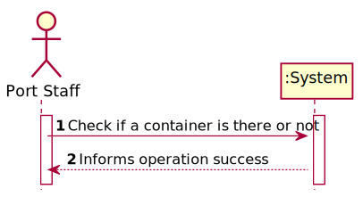
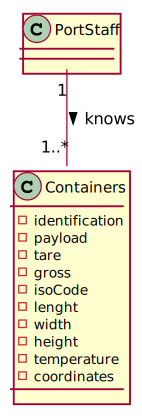
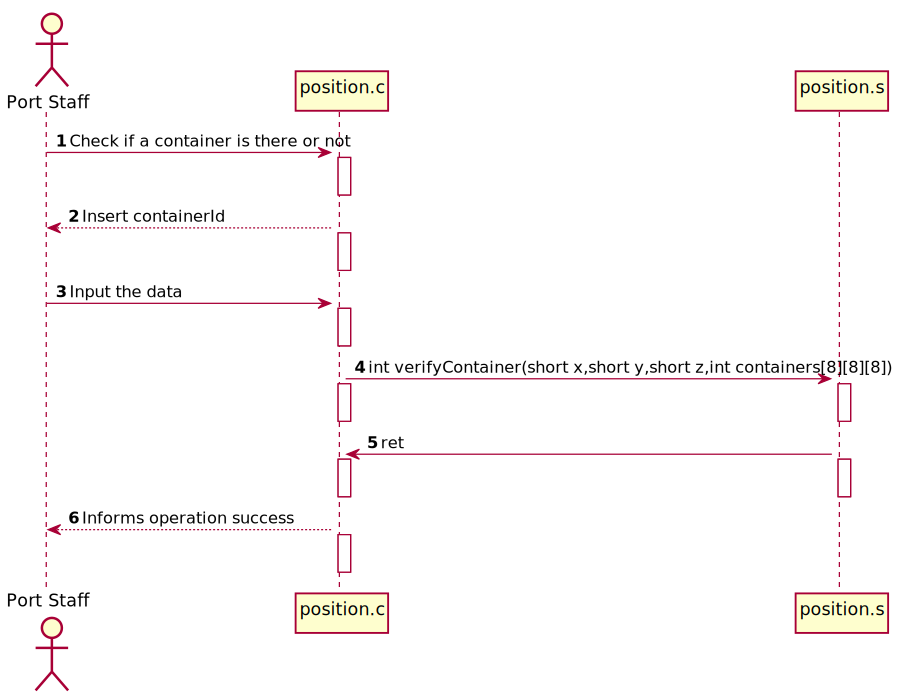
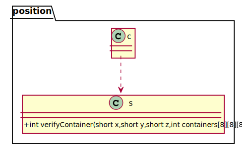

# US 315 - Know if a container is there or not

## 1. Requirements Engineering

### 1.1. User Story Description

As a Port staff, given a position in the transport vehicle, I wish to know if a container is there or not.

### 1.2. Acceptance Criteria

The free/occupied position should be determined by an Assembly function that verifies the matrix filled with the containers’ IDs
The function should return 1 if a container is there or 0, otherwise

### 1.4. Found out Dependencies

US313

### 1.5 Input and Output Data

**Input Data:**

* Typed data:
  - containerId

* Selected data:
  containerId

**Output Data:**

* (In)Success of the operation

### 1.6. System Sequence Diagram (SSD)

### 1.7 Other Relevant Remarks

## 2. OO Analysis

### 2.1. Relevant Domain Model Excerpt

### 2.2. Other Remarks

*N.A.*

### Systematization ##

According to the taken rationale, the conceptual classes promoted to software classes are:

* position.s

Other software classes (i.e. Pure Fabrication) identified:

* position.c

## 3.2. Sequence Diagram (SD)

## 3.3. Class Diagram (CD)

# 4. Tests
*N.A.*

# 5. Construction (Implementation)

## Class position.c
    
        int main(void) {
	    int array [4][2][3]=  {{{2,0,3},{0,2,2}},
		                   {{3,0,0},{0,0,0}},
		                   {{2,4,2},{2,2,2}},
	                       {{2,4,2},{2,2,2}}};
	                       

	int matriz [8][8][8];
	matriz[1][1][1]=2;
	matriz[1][2][1]=7;
	matriz[0][0][0]=0;
	matriz[1][0][1]=4;
	matriz[4][5][4]=0;
	printf("%i",checkSlots(8,8,8, matriz));

## Class position.s
    .section .data
    .section .text
    .global verifyContainer, checkSlots
      verifyContainer:
      movswq	%di, %rdi
      imulq	$40000, %rdi, %rdi
      addq	%rcx, %rdi
      movswq	%dx, %rdx
      movswq	%si, %rsi
      leaq	(%rsi,%rsi,4), %rax
      leaq	(%rax,%rax,4), %rcx
      leaq	0(,%rcx,4), %rax
      addq	%rdx, %rax
      cmpl	$0, (%rdi,%rax,4)
      setne	%al
      movzbl	%al, %eax
      ret
# 6. Integration and Demo

*N.A.*

# 7. Observations

*N.A.*

