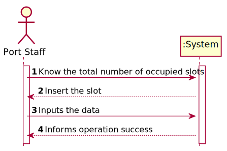
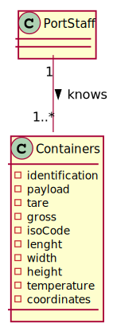
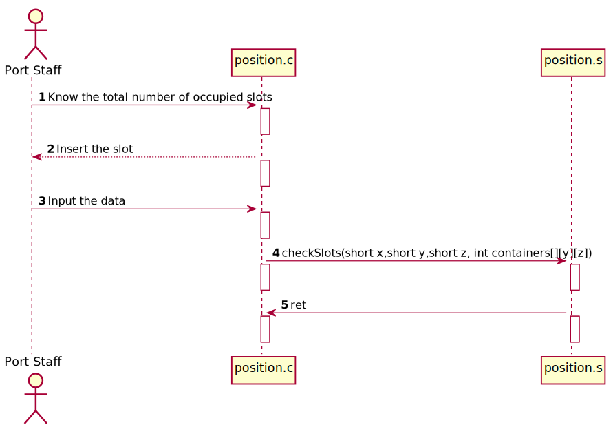
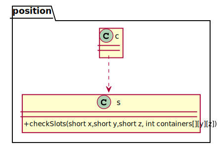

# US 316 - To know the total number of occupied slots

## 1. Requirements Engineering

### 1.1. User Story Description

As a Port staff, given a set of positions, I wish to know the total number of occupied slots

### 1.2. Acceptance Criteria
- Using the Assembly function developed in the previous US, develop
  another Assembly function that traverses an array of positions and
  determines the total number of occupied slots.

### 1.4. Found out Dependencies

US313
US315

### 1.5 Input and Output Data

**Input Data:**

* Typed data:
  slotChoosen

* Selected data:
  slotChoosen

**Output Data:**

* (In)Success of the operation

### 1.6. System Sequence Diagram (SSD)

### 1.7 Other Relevant Remarks

*N.A.*

## 2. OO Analysis

### 2.1. Relevant Domain Model Excerpt

### 2.2. Other Remarks

*N.A.*

### Systematization ##

According to the taken rationale, the conceptual classes promoted to software classes are:

* position.h

Other software classes (i.e. Pure Fabrication) identified:

* position.c

## 3.2. Sequence Diagram (SD)

## 3.3. Class Diagram (CD)

# 4. Tests
*N.A.*

# 5. Construction (Implementation)

## Class position.c

         if (verifyContainer(0,0,0, array)) {
		return 1;
		
	    } else {
	    return 0;
      }

## Class position.s
     
            .section .data
            .section .text
            .global verifyContainer,checkSlots
              verifyContainer:
              movswq	%di, %rdi
              salq	$8, %rdi
              addq	%rcx, %rdi
              movswq	%dx, %rdx
              movswq	%si, %rsi
              leaq	(%rdx,%rsi,8), %rax
              cmpl	$0, (%rdi,%rax,4)
              setne	%al
              movzbl	%al, %eax
              ret
            checkSlots:
              pushq	%r15
              pushq	%r14
              pushq	%r13
              pushq	%r12
              pushq	%rbp
              pushq	%rbx
              subq	$8, %rsp
              movq	%rcx, %r15
              movw	%di, 6(%rsp)
              movw	%si, 4(%rsp)
              movl	%edx, %r13d
              movl	$0, %r14d
              movl	$0, %ebp
              jmp	place2
            place10:
              addl	$1, %r12d
            place5:
              cmpw	4(%rsp), %r12w
              jge	place9
              movl	$0, %ebx
            place4:
              cmpw	%r13w, %bx
              jge	place10
              movswl	%bx, %edx
              movswl	%r12w, %esi
              movswl	%r14w, %edi
              movq	%r15, %rcx
              call	verifyContainer
              cmpl	$1, %eax
              sete	%dl
              movswl	%bp, %ecx
              addl	$1, %ecx
              cmpl	$1, %eax
              setne	%al
              movzbl	%dl, %edx
              imull	%ecx, %edx
              movzbl	%al, %eax
              imull	%eax, %ebp
              addl	%edx, %ebp
              addl	$1, %ebx
              jmp	place4
              place9:
              addl	$1, %r14d
              place2:
              cmpw	6(%rsp), %r14w
              jge	place11
              movl	$0, %r12d
              jmp	place5
              place11:
              movl	%ebp, %eax
              addq	$8, %rsp
              popq	%rbx
              popq	%rbp
              popq	%r12
              popq	%r13
              popq	%r14
              popq	%r15
              ret
# 6. Integration and Demo

*N.A.*

# 7. Observations

*N.A.*

