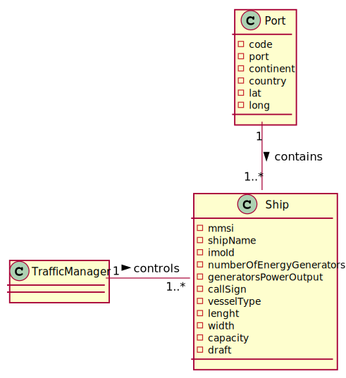

# US 401 - Know which ports are more critical (have greater centrality) in this freight network

## 1. Requirements Engineering

### 1.1. User Story Description

As a Traffic manager I wish to know which ports are more critical (have greater centrality) in this freight network

### 1.2. Acceptance Criteria
- Return the n ports with greater centrality
- The centrality of a port is defined by the number of the shortest paths that pass through it

### 1.4. Found out Dependencies

*N.A.*

### 1.5 Input and Output Data

**Input Data:**
*N.A.*

**Typed data:**
*N.A.*

**Selected data:**
*N.A.*

**Output Data:**

* (In)Success of the operation

### 1.6. System Sequence Diagram (SSD)

### 1.7 Other Relevant Remarks

## 2. OO Analysis

### 2.1. Relevant Domain Model Excerpt

### 2.2. Other Remarks

*N.A.*

### Systematization ##

According to the taken rationale, the conceptual classes promoted to software classes are:

* Algorithms
* MatrixGraph

Other software classes (i.e. Pure Fabrication) identified:

* KnowPortsUI
* CountryController

## 3.2. Sequence Diagram (SD)

## 3.3. Class Diagram (CD)

# 4. Tests

## Class CountryControllerTest

    @Test
    void getCentrality() throws FileNotFoundException {
        ArrayList<String> result = new ArrayList<>();
        ArrayList<String> exp = countryC.getCentrality(3);
        result.add("Marsaxlokk");
        result.add("Galatz");
        result.add("Guayaquil");
        assertEquals(exp,result);
    }

    @Test
    void getCentrality2() throws FileNotFoundException {
        ArrayList<String> result = new ArrayList<>();
        ArrayList<String> exp = countryC.getCentrality(5);
        result.add("Marsaxlokk");
        result.add("Galatz");
        result.add("Guayaquil");
        result.add("Cartagena");
        result.add("Larnaca");
        assertEquals(exp,result);
    }

    @Test
    void getCentrality3() throws FileNotFoundException {
        ArrayList<String> result = new ArrayList<>();
        ArrayList<String> exp = countryC.getCentrality(8);
        result.add("Marsaxlokk");
        result.add("Galatz");
        result.add("Guayaquil");
        result.add("Cartagena");
        result.add("Larnaca");
        result.add("Buenaventura");
        result.add("Constantza");
        result.add("Esmeraldas");
        assertEquals(exp,result);
    }

# 5. Construction (Implementation)

## Class CountryController
    public ArrayList<String> getCentrality(int numberOfPorts) throws FileNotFoundException {
        lstCountry = LoaderController.loadCountry("countries.csv");
       MatrixGraph<String, Double> cloneMatrix = matrixGraph.clone();
       TreeMap<Integer, String> portsNumberOfVertices = new TreeMap<>();
       for(Country country : lstCountry){
           cloneMatrix.removeVertex(country.getCap());
       }
        MatrixGraph<String, Double> graphMin = Algorithms.minDistGraph(matrixGraph,Double::compare, Double::sum);
       for(String vert : graphMin.vertices()){
           Collection<String> vertsAdj = graphMin.adjVertices(vert);
           Integer numberOfVerts = vertsAdj.size();
           portsNumberOfVertices.put(numberOfVerts,vert);
       }
       ArrayList<String> finalList = new ArrayList<>();
        for(Integer e : portsNumberOfVertices.descendingKeySet()){
            if(numberOfPorts>0){
                String port = portsNumberOfVertices.get(e);
                finalList.add(port);
                numberOfPorts--;
            }else break;
        }
        System.out.printf(cloneMatrix.toString());
        return finalList;
    }

# 6. Integration and Demo

*N.A.*

# 7. Observations

*N.A.*

