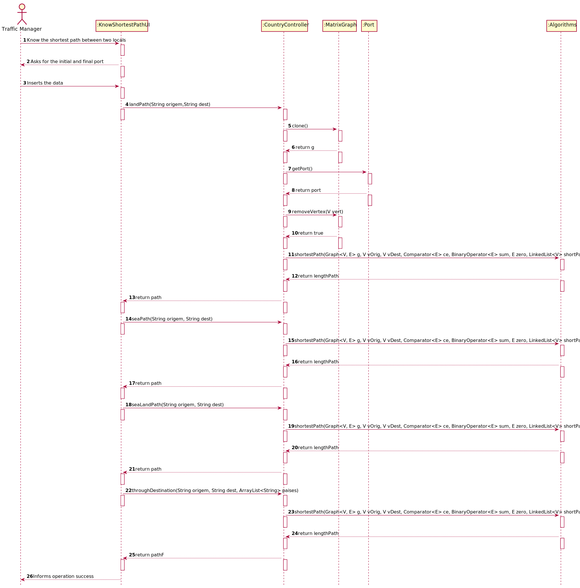

# US 402 - Know the shortest path between two locals

## 1. Requirements Engineering

### 1.1. User Story Description

As a Traffic manager I wish to know the shortest path between two locals (city and/or port)

### 1.2. Acceptance Criteria
- Land path (only includes land routes, may start/end in port/city)
- Maritime path (only includes ports)
- Land or sea path (may include cities and ports)
- Obligatorily passing through n indicated places

### 1.4. Found out Dependencies

US401

### 1.5 Input and Output Data

**Input Data:**
* portOrig
* portDest

**Typed data:**
* portOrig
* portDest

**Selected data:**
*N.A.*

**Output Data:**

* (In)Success of the operation

### 1.6. System Sequence Diagram (SSD)

### 1.7 Other Relevant Remarks

## 2. OO Analysis

### 2.1. Relevant Domain Model Excerpt

### 2.2. Other Remarks

*N.A.*

### Systematization ##

According to the taken rationale, the conceptual classes promoted to software classes are:

* Algorithms
* MatrixGraph
* Port

Other software classes (i.e. Pure Fabrication) identified:

* KnowShortestPathUI
* CountryController

## 3.2. Sequence Diagram (SD)

## 3.3. Class Diagram (CD)

# 4. Tests

## Class CountryControllerTest

    @Test
    void seaPath() {
        LinkedList<String> res = new LinkedList<>();
        LinkedList<String> expected = countryC.seaPath("Rio Grande",  "Santos");
        res.addFirst("Rio Grande");
        res.addLast("Salvador");
        res.addLast("Santos");
        assertEquals(expected,res);
    }

    @Test
    void seaLandPath() {
        LinkedList<String> res = new LinkedList<>();
        LinkedList<String> expected = countryC.seaLandPath("Madrid",  "Valencia");
        res.addFirst("Madrid");
        res.addLast("Barcelona");
        res.addLast("Valencia");
        assertEquals(expected,res);
    }

    @Test
    void throughDestination() {
        LinkedList<String> res = new LinkedList<>();
        ArrayList<String> pais = new ArrayList<>();
        pais.add("Barcelona");
        LinkedList<String> expected = countryC.throughDestination("Madrid",  "Valencia",pais);
        res.addFirst("Madrid");
        res.addLast("Barcelona");
        res.addLast("Valencia");
        assertEquals(expected,res);
    }

    @Test
    void landPath() {
        LinkedList<String> res = new LinkedList<>();
        LinkedList<String> expected = countryC.landPath("Lisbon",  "Barcelona");
        res.addFirst("Lisbon");
        res.addLast("Madrid");
        res.addLast("Barcelona");
        assertEquals(expected,res);
    }

## Class MatrixAlgorithmsTest

        @Test
        public void testShortestPath() {
        System.out.println("Test of shortest path");

        LinkedList<String> shortPath = new LinkedList<>();

        Integer lenPath = graph.Algorithms.shortestPath(completeMap, "Porto", "LX", Integer::compare, Integer::sum, 0, shortPath);
        assertNull(lenPath, "Length path should be null if vertex does not exist");
        assertEquals(0, shortPath.size(), "Shortest Path does not exist");

        lenPath = graph.Algorithms.shortestPath(incompleteMap, "Porto", "Faro", Integer::compare, Integer::sum, 0, shortPath);
        assertNull(lenPath, "Length path should be null if vertex does not exist");
        assertEquals(0, shortPath.size(), "Shortest Path does not exist");

        lenPath = graph.Algorithms.shortestPath(completeMap, "Porto", "Porto", Integer::compare, Integer::sum, 0, shortPath);
        assertEquals(0, lenPath, "Length path should be 0 if vertices are the same");
        assertEquals(Arrays.asList("Porto"), shortPath, "Shortest Path only contains Porto");

        lenPath = graph.Algorithms.shortestPath(incompleteMap, "Porto", "Lisboa", Integer::compare, Integer::sum, 0, shortPath);
        assertEquals(335, lenPath, "Length path should be 0 if vertices are the same");
        assertEquals(Arrays.asList("Porto", "Aveiro", "Coimbra", "Lisboa"), shortPath, "Shortest Path Porto - Lisboa");

        lenPath = graph.Algorithms.shortestPath(incompleteMap, "Braga", "Leiria", Integer::compare, Integer::sum, 0, shortPath);
        assertEquals(255, lenPath, "Length path should be 0 if vertices are the same");
        assertEquals(Arrays.asList("Braga", "Porto", "Aveiro", "Leiria"), shortPath, "Shortest Path Braga - Leiria");

        lenPath = graph.Algorithms.shortestPath(completeMap, "Porto", "Castelo Branco", Integer::compare, Integer::sum, 0, shortPath);
        assertEquals(335, lenPath, "Length path should be 0 if vertices are the same");
        assertEquals(Arrays.asList("Porto", "Aveiro", "Viseu", "Guarda", "Castelo Branco"), shortPath, "Shortest Path Porto - Castelo Branco");

        //Changing Edge: Aveiro-Viseu with Edge: Leiria-C.Branco
        //should change shortest path between Porto and Castelo Branco

        completeMap.removeEdge("Aveiro", "Viseu");
        completeMap.addEdge("Leiria", "Castelo Branco", 170);

        lenPath = graph.Algorithms.shortestPath(completeMap, "Porto", "Castelo Branco", Integer::compare, Integer::sum, 0, shortPath);
        assertEquals(365, lenPath, "Length path should be 0 if vertices are the same");
        assertEquals(Arrays.asList("Porto", "Aveiro", "Leiria", "Castelo Branco"), shortPath, "Shortest Path Porto - Castelo Branco");
    }

     // Test of shortestPaths method, of class Algorithms.

    @Test
    public void testShortestPaths() {
        System.out.println("Test of shortest path");

        ArrayList<LinkedList<String>> paths = new ArrayList<>();
        ArrayList<Integer> dists = new ArrayList<>();

        graph.Algorithms.shortestPaths(completeMap, "Porto", Integer::compare, Integer::sum, 0, paths, dists);

        assertEquals(paths.size(), dists.size(), "There should be as many paths as sizes");
        assertEquals(completeMap.numVertices(), paths.size(), "There should be a path to every vertex");
        assertEquals(Arrays.asList("Porto"), paths.get(completeMap.key("Porto")), "Number of nodes should be 1 if source and vertex are the same");
        assertEquals(Arrays.asList("Porto", "Aveiro", "Coimbra", "Lisboa"), paths.get(completeMap.key("Lisboa")), "Path to Lisbon");
        assertEquals(Arrays.asList("Porto", "Aveiro", "Viseu", "Guarda", "Castelo Branco"), paths.get(completeMap.key("Castelo Branco")), "Path to Castelo Branco");
        assertEquals(335, dists.get(completeMap.key("Castelo Branco")), "Path between Porto and Castelo Branco should be 335 Km");

        //Changing Edge: Aveiro-Viseu with Edge: Leiria-C.Branco
        //should change shortest path between Porto and Castelo Branco
        completeMap.removeEdge("Aveiro", "Viseu");
        completeMap.addEdge("Leiria", "Castelo Branco", 170);
        graph.Algorithms.shortestPaths(completeMap, "Porto", Integer::compare, Integer::sum, 0, paths, dists);
        assertEquals(365, dists.get(completeMap.key("Castelo Branco")), "Path between Porto and Castelo Branco should now be 365 Km");
        assertEquals(Arrays.asList("Porto", "Aveiro", "Leiria", "Castelo Branco"), paths.get(completeMap.key("Castelo Branco")), "Path to Castelo Branco");

        graph.Algorithms.shortestPaths(incompleteMap, "Porto", Integer::compare, Integer::sum, 0, paths, dists);
        assertNull(dists.get(completeMap.key("Faro")), "Length path should be null if there is no path");
        assertEquals(335, dists.get(completeMap.key("Lisboa")), "Path between Porto and Lisboa should be 335 Km");
        assertEquals(Arrays.asList("Porto", "Aveiro", "Coimbra", "Lisboa"), paths.get(completeMap.key("Lisboa")), "Path to Lisboa");

        graph.Algorithms.shortestPaths(incompleteMap, "Braga", Integer::compare, Integer::sum, 0, paths, dists);
        assertEquals(255, dists.get(completeMap.key("Leiria")), "Path between Braga and Leiria should be 255 Km");
        assertEquals(Arrays.asList("Braga", "Porto", "Aveiro", "Leiria"), paths.get(completeMap.key("Leiria")), "Path to Leiria");
    }

# 5. Construction (Implementation)

## Class CountryController
    public LinkedList<String> landPath(String origem,String dest){
       LinkedList<String> path = new LinkedList<>();
       MatrixGraph<String, Double> cloneMatrix = matrixGraph.clone();
       Port origem1 = getPortByName(origem, lstPorts);
       Port dest1 = getPortByName(dest, lstPorts);
       Country origem2 = getCountryByCap(origem, lstCountry);
       Country dest2 = getCountryByCap(dest, lstCountry);
       if ((origem2 == null && origem1 == null) || (dest1 == null && dest2 == null)) {
           System.out.println("Inválido");
           return null;
       }
       for (Port p : lstPorts){
           if(!(p.getPort().equals(origem) || p.getPort().equals(dest))){
               cloneMatrix.removeVertex(p.getPort());
           }
       }
       Algorithms.shortestPath(cloneMatrix,origem,dest,Double::compare,Double::sum,0.0,path);
       return path;
}

    public LinkedList<String> seaPath(String origem, String dest) {
        LinkedList<String> path = new LinkedList<>();
        MatrixGraph<String, Double> cloneMatrix = matrixGraph.clone();

        for (Country s : lstCountry) {
            cloneMatrix.removeVertex(s.getCap());
        }
        Port origem1 = getPortByName(origem, lstPorts);
        Port dest1 = getPortByName(dest, lstPorts);
        if (origem1 == null || dest1 == null) {
            System.out.println("Inválido");
            return null;
        }
        graph.Algorithms.shortestPath(cloneMatrix, origem, dest, Double::compare, Double::sum, 0.0, path);
        return path;
    }

    public LinkedList<String> seaLandPath(String origem, String dest) {
        LinkedList<String> path = new LinkedList<>();
        Port origem1 = getPortByName(origem, lstPorts);
        Port dest1 = getPortByName(dest, lstPorts);
        Country origem2 = getCountryByCap(origem, lstCountry);
        Country dest2 = getCountryByCap(dest, lstCountry);
        if ((origem2 == null && origem1 == null) || (dest1 == null && dest2 == null)) {
            System.out.println("Inválido");
            return null;
        }
        Algorithms.shortestPath(matrixGraph, origem, dest, Double::compare, Double::sum, 0.0, path);
        return path;
    }

    public LinkedList<String> throughDestination(String origem, String dest, ArrayList<String> paises) {
        LinkedList<String> path = new LinkedList<>();
        LinkedList<String> pathF = new LinkedList<>();
        Port origem1 = getPortByName(origem, lstPorts);
        Port dest1 = getPortByName(dest, lstPorts);
        Country origem2 = getCountryByCap(origem, lstCountry);
        Country dest2 = getCountryByCap(dest, lstCountry);
        if ((origem2 == null && origem1 == null) || (dest1 == null && dest2 == null)) {
            System.out.println("Inválido");
            return null;
        }
        String atual = origem;
        for (String s : paises) {
            Port dest3 = getPortByName(s, lstPorts);
            Country origem3 = getCountryByCap(s, lstCountry);
            if (dest3 != null || origem3 != null)
                Algorithms.shortestPath(matrixGraph, atual, s, Double::compare, Double::sum, 0.0, path);
            atual = s;
            for (String s1 : path) {
                if (!pathF.contains(s1))
                    pathF.addLast(s1);
            }
        }
        Algorithms.shortestPath(matrixGraph, atual, dest, Double::compare, Double::sum, 0.0, path);
        for (String s1 : path) {
            if (!pathF.contains(s1))
                pathF.addLast(s1);
        }
        return pathF;
    }

## Class Algorithms

         /** Shortest-path between two vertices
     *
     * @param g graph
     * @param vOrig origin vertex
     * @param vDest destination vertex
     * @param ce comparator between elements of type E
     * @param sum sum two elements of type E
     * @param zero neutral element of the sum in elements of type E
     * @param shortPath returns the vertices which make the shortest path
     * @return if vertices exist in the graph and are connected, true, false otherwise
     */
    public static <V, E> E shortestPath(Graph<V, E> g, V vOrig, V vDest,
                                        Comparator<E> ce, BinaryOperator<E> sum, E zero,
                                        LinkedList<V> shortPath) {

        if (!g.validVertex(vOrig) || !g.validVertex(vDest))
            return null;

        shortPath.clear();
        int numVerts = g.numVertices();
        boolean[] visited = new boolean[numVerts]; //default value: false
        @SuppressWarnings("unchecked")
        V[] pathKeys = (V[]) new Object [numVerts];
        @SuppressWarnings("unchecked")
        E[] dist = (E[]) new Object [numVerts];
        initializePathDist(numVerts, pathKeys, dist);

        shortestPathDijkstra(g, vOrig, ce, sum, zero, visited, pathKeys, dist);

        E lengthPath = dist[g.key(vDest)];

        if (lengthPath != null) {
            getPath(g, vOrig, vDest, pathKeys, shortPath);
            return lengthPath;
        }
        return null;
    }

    /** Shortest-path between a vertex and all other vertices
     *
     * @param g graph
     * @param vOrig start vertex
     * @param ce comparator between elements of type E
     * @param sum sum two elements of type E
     * @param zero neutral element of the sum in elements of type E
     * @param paths returns all the minimum paths
     * @param dists returns the corresponding minimum distances
     * @return if vOrig exists in the graph true, false otherwise
     */
    public static <V, E> boolean shortestPaths(Graph<V, E> g, V vOrig,
                                               Comparator<E> ce, BinaryOperator<E> sum, E zero,
                                               ArrayList<LinkedList<V>> paths, ArrayList<E> dists) {

        if (!g.validVertex(vOrig)) return false;

        paths.clear(); dists.clear();
        int numVerts = g.numVertices();
        boolean[] visited = new boolean[numVerts]; //default value: false
        @SuppressWarnings("unchecked")
        V[] pathKeys = (V[]) new Object [numVerts];
        @SuppressWarnings("unchecked")
        E[] dist = (E[]) new Object [numVerts];
        initializePathDist(numVerts, pathKeys, dist);

        shortestPathDijkstra(g, vOrig, ce, sum, zero, visited, pathKeys, dist);

        dists.clear();
        paths.clear();
        for (int i = 0; i < numVerts; i++) {
            paths.add(null);
            dists.add(null);
        }
        for (V vDst : g.vertices()) {
            int i = g.key(vDst);
            if (dist[i] != null) {
                LinkedList<V> shortPath = new LinkedList<>();
                getPath(g, vOrig, vDst, pathKeys, shortPath);
                paths.set(i, shortPath);
                dists.set(i, dist[i]);
            }
        }
        return true;
    }

# 6. Integration and Demo

*N.A.*

# 7. Observations

*N.A.*

