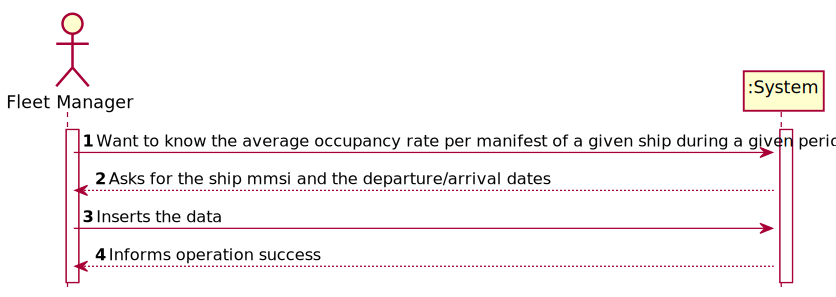
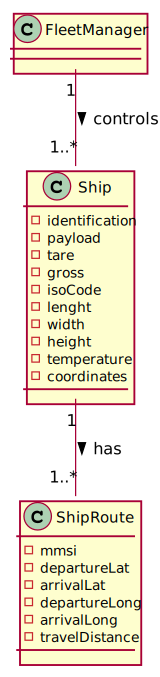
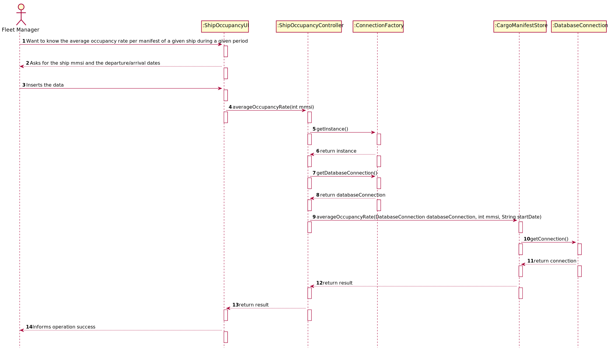
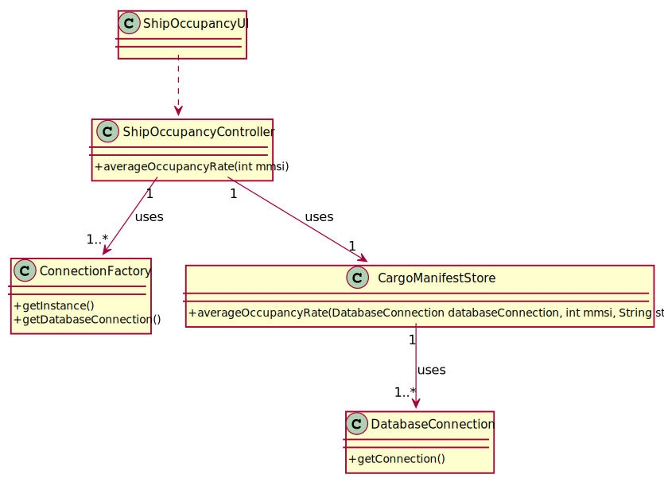

# US 405 - Know the average occupancy rate per manifest of a given ship during a given period

## 1. Requirements Engineering

### 1.1. User Story Description

As Fleet Manager, I want to know the average occupancy rate per manifest of a given ship during a given period

### 1.2. Acceptance Criteria
- Ship is properly identified and considered
- Period is properly identified and considered
- Average occupancy rate per manifest and ship is correctly computed.

### 1.4. Found out Dependencies

*N.A.*

### 1.5 Input and Output Data

**Input Data:**
- mmsi
- arrivalDate
- departureDate

**Typed data:**
  *N.A.*

**Selected data:**
- mmsi
- arrivalDate
- departureDate

**Output Data:**

* (In)Success of the operation

### 1.6. System Sequence Diagram (SSD)

### 1.7 Other Relevant Remarks

## 2. OO Analysis

### 2.1. Relevant Domain Model Excerpt

### 2.2. Other Remarks

*N.A.*

### Systematization ##

According to the taken rationale, the conceptual classes promoted to software classes are:

* ConnectionFactory
* CargoManifestStore
* DatabaseConnection

Other software classes (i.e. Pure Fabrication) identified:

* ShipOccupancyUI
* ShipOccupancyController

## 3.2. Sequence Diagram (SD)

## 3.3. Class Diagram (CD)

# 4. Tests

*N.A.*
# 5. Construction (Implementation)

## Class ShipOccupancyController
    public void averageOccupancyRate(int mmsi) throws IOException {
        Scanner in = new Scanner(System.in);
        DatabaseConnection databaseConnection = null;
        System.out.println("What's the START date?");
        String StartDate = in.nextLine();
        databaseConnection = ConnectionFactory.getInstance()
                .getDatabaseConnection();
        CargoManifestStore cargoManifestStore = new CargoManifestStore();
        String result=cargoManifestStore.averageOccupancyRate(databaseConnection,mmsi,StartDate);
        System.out.println("MMSI  ||  CARGOMANIFESTID ||  AVERAGE RATE(%)");
        System.out.println(result);

    }

## Class CargoManifestStore
       public String averageOccupancyRate(DatabaseConnection databaseConnection, int mmsi, String startDate) {
        Scanner in = new Scanner(System.in);
        System.out.println("What's the FINAL date?");
        String finalDate = in.next();
        Connection connection = databaseConnection.getConnection();
        String result="";
        try (CallableStatement callfunctions = connection.prepareCall("{?=call fnc_averageOccupancyRate(?,?,?)}")){
            callfunctions.registerOutParameter(1, OracleTypes.CURSOR);
            callfunctions.setInt(2,mmsi);
            callfunctions.setString(3,startDate);
            callfunctions.setString(4,finalDate);
            callfunctions.execute();
            try (ResultSet resultSet =(ResultSet) callfunctions.getObject(1)) {
                while (resultSet.next()){;
                    result += String.format("%10s" + "%10s" + "%10s"  ,resultSet.getInt(1),
                            resultSet.getInt(2), resultSet.getInt(3) +"\n");
                }
            }
            return result;
        }catch (SQLException tt){tt.printStackTrace();}
        return null;

    }

# 6. Integration and Demo

*N.A.*

# 7. Observations

*N.A.*

