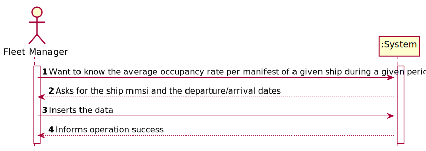
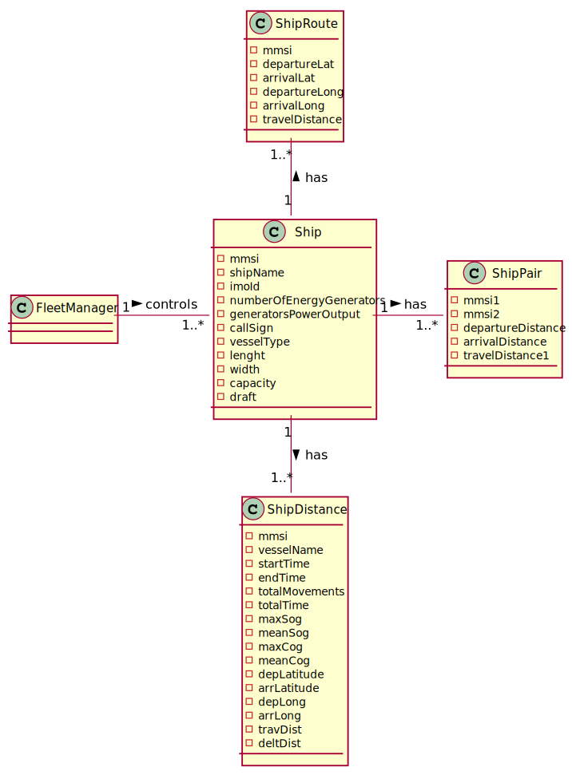
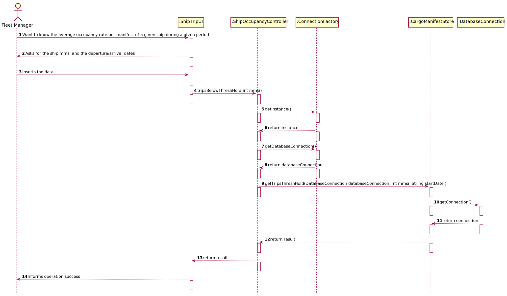
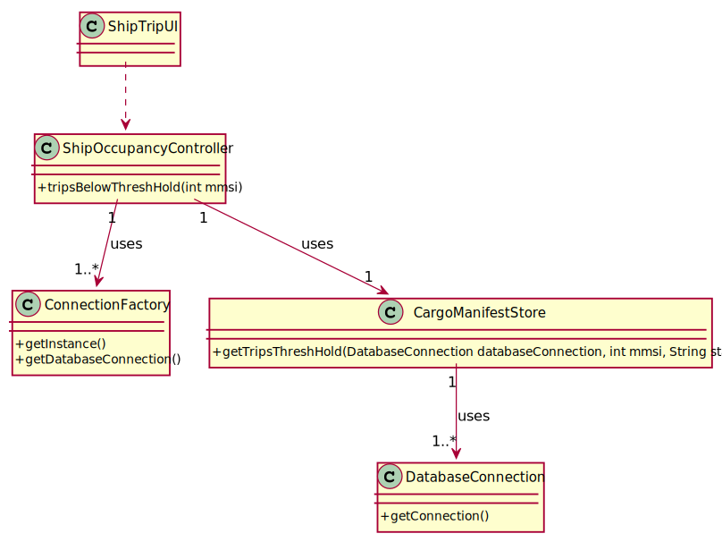

# US 406 - Know which ship voyages – place and date of origin and destination

## 1. Requirements Engineering

### 1.1. User Story Description

As Fleet Manager, I want to know which ship voyages – place and date of origin and destination – had an occupancy rate below a certain threshold; by default, consider an occupancy rate threshold of 66%. Only the trips already concluded are to be considered

### 1.2. Acceptance Criteria
- Reuses US405
- Average occupancy rate is properly computed
- Trips still ongoing are not considered for the occupancy rate calculations

### 1.4. Found out Dependencies

*N.A.*

### 1.5 Input and Output Data

**Input Data:**
- mmsi
- arrivalDate
- departureDate

**Typed data:**
*N.A.*

**Selected data:**
- mmsi
- arrivalDate
- departureDate

**Output Data:**

* (In)Success of the operation

### 1.6. System Sequence Diagram (SSD)

### 1.7 Other Relevant Remarks

## 2. OO Analysis

### 2.1. Relevant Domain Model Excerpt

### 2.2. Other Remarks

*N.A.*

### Systematization ##

According to the taken rationale, the conceptual classes promoted to software classes are:

* ConnectionFactory
* CargoManifestStore
* DatabaseConnection

Other software classes (i.e. Pure Fabrication) identified:

* ShipTripUI
* ShipOccupancyController

## 3.2. Sequence Diagram (SD)

## 3.3. Class Diagram (CD)

# 4. Tests

*N.A.*
# 5. Construction (Implementation)

## Class ShipOccupancyController
     public void tripsBelowThreshHold(int mmsi) throws IOException {
        Scanner in = new Scanner(System.in);
        System.out.println("whats the starting date? YYYY-MM-DD");
        String startDate = in.nextLine();

        DatabaseConnection databaseConnection;
        databaseConnection = ConnectionFactory.getInstance()
                .getDatabaseConnection();
        CargoManifestStore cargoManifestStore = new CargoManifestStore();
        String result = cargoManifestStore.getTripsThreshHold(databaseConnection,mmsi,startDate);
        System.out.println("TRIPID || START LOCATION || START DATE || END LOCATION || END DATE || AVG RATE(%)");
        System.out.println(result);
    }

## Class CargoManifestStore
        public String getTripsThreshHold(DatabaseConnection databaseConnection, int mmsi, String startDate ) {
        Scanner in = new Scanner(System.in);
        System.out.println("whats the ending date? YYYY-MM-DD");
        String endDate = in.nextLine();
        Connection connection = databaseConnection.getConnection();
        String result="";
        try (CallableStatement callfunctions = connection.prepareCall("{?=call fnc_tripThreshHold(?,?,?)}")){
            callfunctions.registerOutParameter(1, OracleTypes.CURSOR);
            callfunctions.setInt(2,mmsi);
            callfunctions.setString(3,startDate);
            callfunctions.setString(4,endDate);
            callfunctions.execute();
            try (ResultSet resultSet =(ResultSet) callfunctions.getObject(1)) {
                while (resultSet.next()) {
                    ;
                    result += String.format("%10s" + "%10s" + "%10s" + "%10s" + "%10s" + "%10s", resultSet.getInt(1),
                            resultSet.getString(2), resultSet.getString(3) +
                                    resultSet.getString(4), resultSet.getString(5) +resultSet.getInt(6)+"\n");
                }
            }
            return result;
        }catch (SQLException tt){tt.printStackTrace();}
        return null;
    }

# 6. Integration and Demo

*N.A.*

# 7. Observations

*N.A.*

