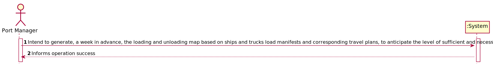
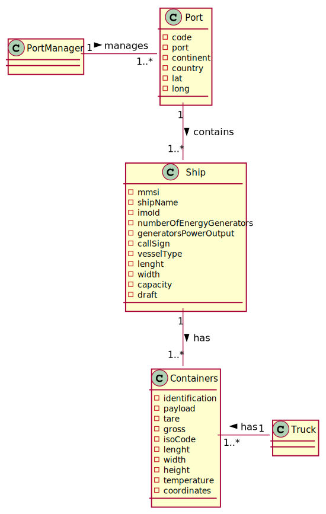
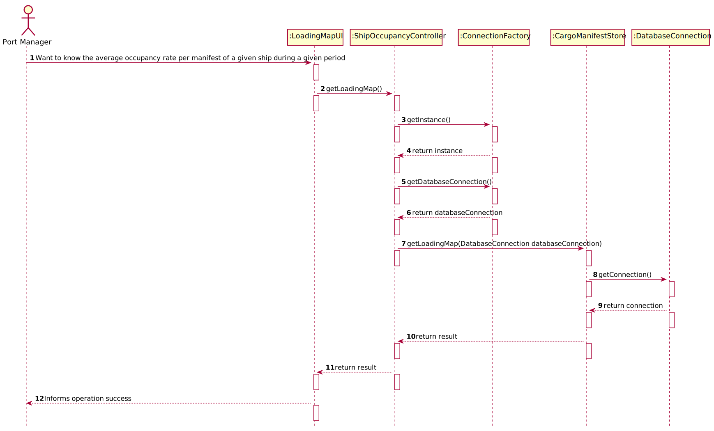
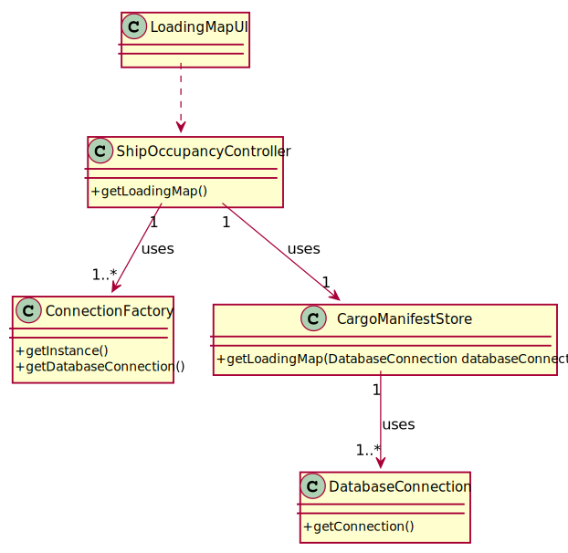

# US 407 - Intend to generate, a week in advance, the loading and unloading map based on ships and trucks load manifests and corresponding travel plans, to anticipate the level of sufficient and necessary resources

## 1. Requirements Engineering

### 1.1. User Story Description

As Port manager, I intend to generate, a week in advance, the loading and unloading map based on ships and trucks load manifests and corresponding travel plans, to anticipate the level of sufficient and necessary resources (loading and unloading staff, warehouse staff, ...).

### 1.2. Acceptance Criteria
- Week in advance is properly identified
- Loading and unloading map is comprehensive
- Loading and unloading map is clear with respect to the sufficient and necessary resources for loading and unloading tasks

### 1.4. Found out Dependencies

*N.A.*

### 1.5 Input and Output Data

**Input Data:**
*N.A.*

**Typed data:**
*N.A.*

**Selected data:**
*N.A.*

**Output Data:**

* (In)Success of the operation

### 1.6. System Sequence Diagram (SSD)

### 1.7 Other Relevant Remarks

## 2. OO Analysis

### 2.1. Relevant Domain Model Excerpt

### 2.2. Other Remarks

*N.A.*

### Systematization ##

According to the taken rationale, the conceptual classes promoted to software classes are:

* ConnectionFactory
* CargoManifestStore
* DatabaseConnection

Other software classes (i.e. Pure Fabrication) identified:

* LoadingMapUI
* ShipOccupancyController

## 3.2. Sequence Diagram (SD)

## 3.3. Class Diagram (CD)

# 4. Tests

*N.A.*
# 5. Construction (Implementation)

## Class ShipOccupancyController
    public void getLoadingMap()throws IOException{
        DatabaseConnection databaseConnection;
        databaseConnection = ConnectionFactory.getInstance()
                .getDatabaseConnection();
        CargoManifestStore cargoManifestStore = new CargoManifestStore();
        String result = cargoManifestStore.getLoadingMap(databaseConnection);
        System.out.println("TRANSPORT TYPE || TRANSPORT ID || LOADING TYPE || TRANSPORTDATE");
        System.out.println(result);

    }
    

## Class CargoManifestStore
       public String getLoadingMap(DatabaseConnection databaseConnection) {
        Connection connection = databaseConnection.getConnection();
        String result="";
        try (CallableStatement callfunctions = connection.prepareCall("{?=call fnc_LoadingMap()}")){
            callfunctions.registerOutParameter(1, OracleTypes.CURSOR);
            callfunctions.execute();
            try (ResultSet resultSet =(ResultSet) callfunctions.getObject(1)) {
                while (resultSet.next()){;
                    result += String.format("%10s" + "%10s" + "%10s" +"%10s"  ,resultSet.getString(1)+"         ",resultSet.getInt(2)+ "         ",
                            resultSet.getString(3) +"         " , resultSet.getString(4) +"\n");
                }
            }
            return result;
        }catch (SQLException tt){tt.printStackTrace();}
        return null;
    }

# 6. Integration and Demo

*N.A.*

# 7. Observations

*N.A.*

