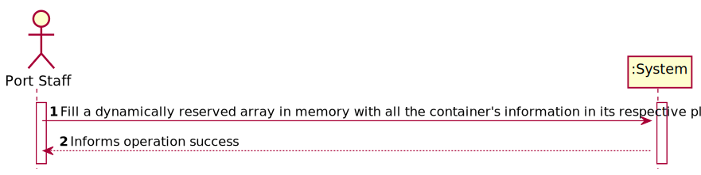
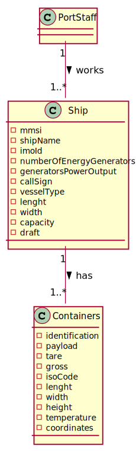
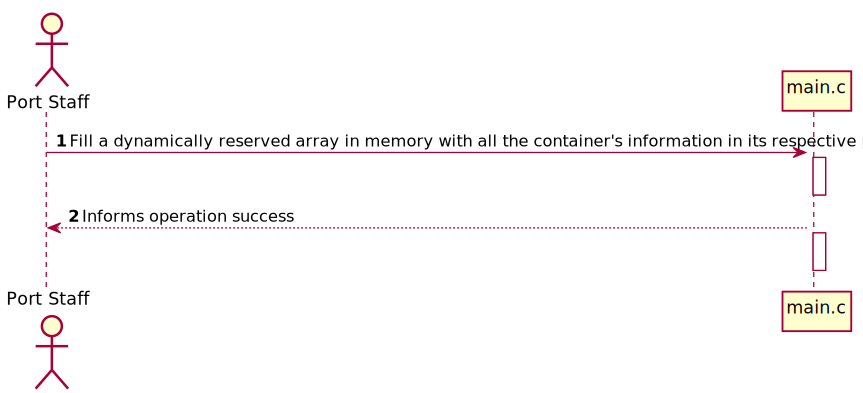

# US 409 - Fill a dynamically reserved array in memory with all the container's information in its respective place

## 1. Requirements Engineering

### 1.1. User Story Description

As a Port staff given a Cargo Manifest, I wish to fill a dynamically reserved array in memory with all the container's information in its respective place.
### 1.2. Acceptance Criteria
- The array should be dynamically reserved in C, adjusting the size of the array to the amount of handled data.
- All the details of a container can be present in more than one file. As such, define a struct that represents a container. Therefore, in the end, you should have a matrix of structs
- The data types chosen for each field of the struct should be adjusted to the types of values they store. Memory usage should be kept to the minimum required. Also consider the order of fields that minimizes memory consumption

### 1.4. Found out Dependencies

*N.A.*

### 1.5 Input and Output Data

**Input Data:**
*N.A.*

**Typed data:**
*N.A.*

**Selected data:**
*N.A.*

**Output Data:**

* (In)Success of the operation

### 1.6. System Sequence Diagram (SSD)

### 1.7 Other Relevant Remarks

## 2. OO Analysis

### 2.1. Relevant Domain Model Excerpt

### 2.2. Other Remarks

*N.A.*

### Systematization ##

According to the taken rationale, the conceptual classes promoted to software classes are:

*N.A.*

Other software classes (i.e. Pure Fabrication) identified:

* c

## 3.2. Sequence Diagram (SD)

## 3.3. Class Diagram (CD)

# 4. Tests

*N.A.*
# 5. Construction (Implementation)

## Class c
    #include <stdio.h>
    #include <stdlib.h>
    #include <string.h>
    
    typedef struct key_value {
    long containerId;
    int innerWallCondutivity;
    char innerWallMaterial[16];
    int innerWallThickness;
    int centerWallCondutivity;
    char centerWallMaterial[16];
    int centerWallThickness;
    int outerWallCondutivity;
    char outerWallMaterial[16];
    int outerWallThickness;
    int xCoord;
    int yCoord;
    int zCoord;
    int isoCode;
    int lenght;
    int width;
    int height;
    int exposedArea;
    int refrigerated;
    }dict;
    
    
    int main() {
    void printValues(dict values[]);
    //Initialize the pointer FILE
    FILE *fp = fopen("containerInfo.csv", "r"); //open in read more
    if(!fp) {
    printf("Error occured");
            return 0;
        }

	char buff[21]; //stores the first 21 lines into buff
	int row_count = 0;
	int field_count = 0;
	
	dict values [21]; // array to structs to store values
	
	int i=0; 
	char containerIdstr[16],  iwcStr[16],  iwtStr[16],  cwcStr[16],  cwtStr[16],  otcStr[16],  ottStr[16],  xCStr[2], yCStr[2], zCStr[2], isoCodeStr[16], lenghtStr[16], widthStr[16], heightStr[16], areaStr[16], refrigeratedStr[16];
	while(fgets(buff, 21, fp)) {
		field_count = 0;
		row_count++;
		if(row_count == 1)
			continue;
			
		char *field= strtok(buff, ",");
		while(field) {
			if (field_count == 0) {
				strcpy(containerIdstr, field);
				values[i].containerId=(long)atol(containerIdstr);
			}
			if (field_count == 1) {
				strcpy(values[i].innerWallMaterial, field);
			}
			if (field_count == 2) {
				strcpy(iwcStr, field);
				values[i].innerWallCondutivity=(int)atol(iwcStr);
			}
			if (field_count == 3) {
				strcpy(iwtStr, field);
				values[i].innerWallThickness=(int)atol(iwtStr);
			}
			if (field_count == 4) {
				strcpy(values[i].centerWallMaterial, field);
			}
			if (field_count == 5) {
				strcpy(cwcStr, field);
				values[i].centerWallCondutivity=(int)atol(cwcStr);
			}
			if (field_count == 6) {
				strcpy(cwtStr, field);
				values[i].centerWallThickness=(int)atol(cwtStr);
			}
			if (field_count == 7) {
			strcpy(values[i].outerWallMaterial, field);
		}
			if (field_count == 8) {
				strcpy(otcStr, field);
				values[i].outerWallCondutivity=(int)atol(otcStr);
			}
			if (field_count == 9) {
				strcpy(ottStr, field);
				values[i].outerWallThickness=(int)atol(ottStr);
			}
			if (field_count == 10) {
				strcpy(xCStr, field);
				values[i].xCoord=(int)atol(xCStr);
			}
			if (field_count == 11) {
				strcpy(yCStr, field);
				values[i].yCoord=(int)atol(yCStr);
			}
			if (field_count == 12) {
				strcpy(zCStr, field);
				values[i].zCoord=(int)atol(zCStr); 
			}
			if (field_count == 13) {
				strcpy(isoCodeStr, field);
				values[i].isoCode=(int)atol(isoCodeStr);
			}
			if (field_count == 14) {
				strcpy(lenghtStr, field);
				values[i].lenght=(int)atol(lenghtStr);
			}
			if (field_count == 15) {
				strcpy(widthStr, field);
				values[i].width=(int)atol(widthStr);
			}
			if (field_count == 16) {
				strcpy(heightStr, field);
				values[i].height=(int)atol(heightStr);
			}
			if (field_count == 17) {
				strcpy(areaStr, field);
				values[i].exposedArea=(int)atol(areaStr);
			}
			if (field_count == 18) {
				strcpy(refrigeratedStr, field);
				values[i].refrigerated=(int)atol(refrigeratedStr);
		    }
				
			field = strtok(NULL, ",");
			field_count++;
			
		}
		
		i++;
		
	}
	
	
	fclose(fp);
	
	printValues(values); 
	
	return 0;
    }

    void printValues(dict values[]) {

	for(int i=0; i<21; i++) {
		printf ("\nID: %ld | IWM: %s | IWC: %d | IWT: %d | CWM: %s | CWC: %d | CWT: %d | OWM: %s | OWC: %d | OWT: %d | XCOORD: %d | YCOORD: %d | ZCOORD: %d | ISOCODE: %d | LENGHT: %d | WIDTH: %d | HEIGHT: %d | AREA: %d | REFRIGERATED: %d\n", values[i].containerId,values[i].innerWallMaterial,values[i].innerWallCondutivity,values[i].innerWallThickness,values[i].centerWallMaterial,values[i].centerWallCondutivity,values[i].centerWallThickness,values[i].outerWallMaterial,values[i].outerWallCondutivity,values[i].outerWallThickness, values[i].xCoord, values[i].yCoord, values[i].zCoord, values[i].isoCode, values[i].lenght, values[i].width, values[i].height, values[i].exposedArea, values[i].refrigerated);
	}

    }

# 6. Integration and Demo

*N.A.*

# 7. Observations

*N.A.*

